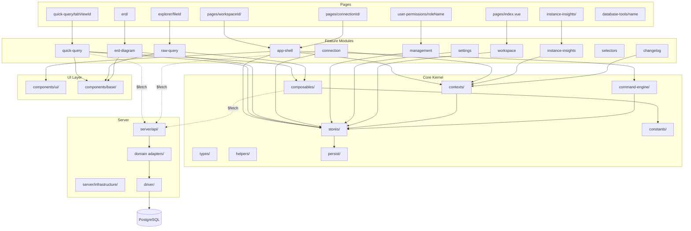

# OrcaQ — Internal Architecture Documentation

> **Document Type:** Internal Technical Architecture Reference  
> **Product:** OrcaQ
> **Version:** 1.0.26  
> **Author:** Principal Frontend Architect (reverse-engineered from source)  
> **Last Updated:** 2026-04-22

---

## 1. Project Overview

### Purpose

OrcaQ is an **open-source, next-generation database editor** — a desktop and web-based IDE for database management, querying, visualization, and administration. It is architecturally comparable to tools like pgAdmin, DBeaver, or TablePlus, but built entirely on modern web technologies and delivered as a hybrid Electron + Web application.

### Business Domain

Database Development & Administration tooling. The application now supports PostgreSQL, MySQL, MariaDB, Oracle, and desktop-only SQLite file connections. PostgreSQL still has the broadest administration surface, while the newer engines currently focus on the core connection, query, and structure-browsing workflows.

### Target Users

- Database developers
- Backend engineers
- DBAs and DevOps engineers
- Data analysts running ad-hoc queries

### Technical Stack

| Layer                 | Technology                                                              |
| --------------------- | ----------------------------------------------------------------------- |
| **Framework**         | Nuxt 3.16+ (Vue 3.5+)                                                   |
| **Language**          | TypeScript 5.6                                                          |
| **Rendering**         | SPA mode (`ssr: false`)                                                 |
| **State Management**  | Pinia 3 + pinia-plugin-persistedstate                                   |
| **UI Library**        | shadcn-vue 2.0 (New York style) + Reka UI primitives                    |
| **Styling**           | Tailwind CSS 4 via `@tailwindcss/vite`                                  |
| **Data Grid**         | AG Grid Community 33 + TanStack Vue Table 8                             |
| **Code Editor**       | CodeMirror 6 (vue-codemirror)                                           |
| **ERD Visualization** | Vue Flow (wrapper over reactflow)                                       |
| **Charts**            | ECharts 5 via vue-echarts                                               |
| **AI Integration**    | Vercel AI SDK 6 (OpenAI, Google Gemini, Anthropic Claude, xAI Grok)     |
| **Database Driver**   | Knex.js with `pg`, `mysql2`, `oracledb`, and `sqlite3` driver bindings  |
| **Desktop Wrapper**   | Electron (via electron-vite, separate `electron/` project)              |
| **D&D**               | Atlassian Pragmatic Drag & Drop                                         |
| **Routing**           | nuxt-typed-router (type-safe route params)                              |
| **Icons**             | @nuxt/icon with Iconify (Lucide, HugeIcons, Logos, Material Icon Theme) |
| **Testing**           | Vitest 4 (unit + nuxt environment) + @vue/test-utils                    |
| **Package Manager**   | Bun 1.2.8                                                               |
| **Docker**            | Multi-stage Node 22 Alpine image                                        |
| **Analytics**         | Amplitude                                                               |
| **Animations**        | GSAP 3, @formkit/auto-animate                                           |

### Rendering Mode

**Pure SPA** — `ssr: false` in both `nuxt.config.ts` and `nuxt.config.electron.ts`. No server-side rendering. The Nitro server is used exclusively as a **BFF (Backend-for-Frontend)** API layer that proxies database connections. For Electron builds, hash-mode routing is enabled with `baseURL: './'`.

---

## 2. Architectural Style

### Paradigm: **Hybrid Modular-Layered with Feature-Sliced Tendencies**

The codebase follows a **modular architecture** where features are organized into self-contained module directories, but with a strong **layered separation** between Core (domain logic), Infrastructure (database adapters), UI (shadcn components), and Feature modules (components/modules/\*).

It is **not** a pure DDD or hexagonal architecture, but borrows key ideas:

- **Domain adapters** with abstract interfaces (`IDatabaseAdapter`, `BaseDomainAdapter`)
- **Factory pattern** for database engine abstraction
- **Composable-first** approach — business logic lives in composables, not in components
- **Flat module convention** — each feature module is a folder under `components/modules/` with its own `hooks/`, `utils/`, `constants/`, `types/`

### Dependency Flow

```
Pages → Components/Modules → Core (stores, composables, types, helpers)
                                    ↓
                              Server API (Nitro routes)
                                    ↓
                         Infrastructure (adapters, drivers)
                                    ↓
                          Database Engine (PostgreSQL/MySQL/MariaDB/Oracle/SQLite)
```

Pages are thin routing shells. Feature modules encapsulate UI + hooks. Core provides shared state and business logic. Server API is a stateless BFF. Infrastructure implements the Adapter pattern for multi-database support.

### Separation of Concerns

| Concern                    | Location                                                      |
| -------------------------- | ------------------------------------------------------------- |
| Routing & page composition | `pages/`                                                      |
| Layout shell (IDE frame)   | `layouts/`, `components/modules/app-shell/`                   |
| Feature logic              | `components/modules/*/hooks/`                                 |
| Shared business logic      | `core/composables/`, `core/contexts/`                         |
| Global state               | `core/stores/` (Pinia)                                        |
| Type definitions           | `core/types/`                                                 |
| Persistence abstraction    | `core/persist/` (IndexedDB for web, Electron IPC for desktop) |
| Design system              | `components/ui/` (shadcn-vue)                                 |
| Reusable base components   | `components/base/`                                            |
| Server-side API handlers   | `server/api/`                                                 |
| Database infrastructure    | `server/infrastructure/`                                      |

---

## 3. Folder Structure Deep Explanation

### Top-Level Directories

| Directory      | Purpose                                                                                                         |
| -------------- | --------------------------------------------------------------------------------------------------------------- |
| `app/`         | SPA loading template (`spa-loading-template.html`)                                                              |
| `assets/`      | Global CSS (Tailwind entry, custom fonts, v-tree styles)                                                        |
| `components/`  | All Vue components: `ui/` (design system), `base/` (reusable primitives), `modules/` (feature modules)          |
| `core/`        | **The domain kernel** — stores, composables, contexts, types, constants, helpers, persist layer, command engine |
| `docs/`        | Documentation output (dependency graphs, this file)                                                             |
| `electron/`    | Standalone Electron project (electron-vite, IPC, main/renderer/preload)                                         |
| `layouts/`     | Nuxt layouts: `default.vue` (IDE shell with resizable panels), `home.vue` (workspace selector)                  |
| `lib/`         | Utility library — currently just `cn()` (clsx + tailwind-merge)                                                 |
| `npx-package/` | npx-distributable package wrapper for quick-start                                                               |
| `pages/`       | Nuxt file-based routing tree                                                                                    |
| `plugins/`     | Nuxt plugins: error handler, pinia-orm (stub)                                                                   |
| `public/`      | Static assets: manifest.json, robots.txt, logo                                                                  |
| `SAC/`         | Docker compose + nginx config for self-hosted deployment                                                        |
| `scripts/`     | Build scripts (app build, npx build, version sync, dependency graph tool)                                       |
| `server/`      | Nitro server: API routes, infrastructure (database adapters, driver layer), middleware                          |
| `test/`        | Test suites: `unit/` (pure logic), `nuxt/` (component tests with Nuxt env)                                      |
| `coverage/`    | Generated test coverage reports                                                                                 |

### Architectural Reasoning

- **`core/` as a standalone kernel**: All business logic, state, and types are in `core/`, making it importable from any layer without circular dependencies. This is the most architecturally significant decision — it decouples domain logic from UI.
- **`components/modules/` as feature slices**: Each database tool feature (quick-query, raw-query, erd-diagram, etc.) is a self-contained module with its own hooks, utilities, and constants. This enables feature-team scalability.
- **`server/infrastructure/` with Adapter pattern**: The double-abstraction (driver layer + domain adapter layer) allows switching database engines without changing API handlers.
- **Dual persistence via `core/persist/`**: The `initIDB()` function patches `window.*Api` globals with IndexedDB implementations for web mode, while Electron's preload scripts provide the same API surface via IPC.

---

## 4. Logical Module Breakdown

### 4.1 Core Kernel (`core/`)

**Layer: Core**

| Sub-module        | Responsibility                                                                                                                                                                     |
| ----------------- | ---------------------------------------------------------------------------------------------------------------------------------------------------------------------------------- |
| `stores/`         | Pinia stores: workspace state, connections, schemas, tab views, activity bar, layout, ERD, explorer files, query logs                                                              |
| `composables/`    | Reusable Vue composables: AI chat, amplitude analytics, app loading, hotkeys, table query builder, SQL highlighting, streaming downloads, range selection, table sizing, clipboard |
| `contexts/`       | Application-level context providers: `useAppContext` (orchestrates stores for connection flow), `useCommandPalette`, `useChangelogModal`, `useSettingsModal`                       |
| `command-engine/` | VS Code-style command palette engine: registry, providers, prefix-based input parsing, command resolution                                                                          |
| `types/`          | Shared TypeScript types for database schemas, tables, views, functions, roles, metrics, insights, queries, exports                                                                 |
| `constants/`      | Application constants: query defaults, debounce timings, AI provider configs, operator sets, workspace icons                                                                       |
| `helpers/`        | Pure utility functions: UUID, byte formatting, clipboard, JSON formatting, SQL formatting, deep unref, environment detection                                                       |
| `persist/`        | IndexedDB abstraction via localforage: connections, workspaces, workspace state, tab views, query files, query logs                                                                |

**Dependencies:** None (this is the innermost layer)  
**Public API:** All exports via barrel `index.ts` files

### 4.2 Design System (`components/ui/`)

**Layer: UI**

30+ shadcn-vue components: Accordion, Alert, AlertDialog, AutoForm, Avatar, Badge, Breadcrumb, Button, Calendar, Card, Checkbox, Collapsible, Command, ContextMenu, Dialog, DropdownMenu, Empty, Form, Input, Kbd, Label, Popover, RadioGroup, Resizable, ScrollArea, Select, Separator, Sheet, Sidebar, Skeleton, Slider, Sonner, Switch, Table, Tabs, Textarea, Tooltip.

**Dependencies:** `lib/utils.ts` (cn helper), Reka UI primitives, class-variance-authority  
**Public API:** Each component exports from its own directory

### 4.3 Base Components (`components/base/`)

**Layer: Shared**

| Component              | Responsibility                                                                 |
| ---------------------- | ------------------------------------------------------------------------------ |
| `BaseCodeEditor`       | CodeMirror 6 wrapper with SQL extensions, minimap, themes, indentation markers |
| `BaseContextMenu`      | Generic context menu component with typed menu schema                          |
| `DynamicTable`         | AG Grid wrapper with virtual scrolling, dynamic columns, row editing           |
| `BaseEmpty`            | Empty state component                                                          |
| `LoadingOverlay`       | Full-screen loading overlay                                                    |
| `TableSkeleton`        | Loading placeholder for tables                                                 |
| `Tree/`                | Tree manager class with CRUD operations, sorting, flat-to-tree conversion      |
| `tree-folder/`         | Drag-and-drop file tree with pseudomorphism drag items                         |
| `CodeHighlightPreview` | Syntax-highlighted code preview (read-only)                                    |

**Dependencies:** `core/`, `components/ui/`  
**Public API:** Direct component imports

### 4.4 Feature: App Shell (`components/modules/app-shell/`)

**Layer: Feature**

The IDE-style application frame:

| Sub-module         | Responsibility                                             |
| ------------------ | ---------------------------------------------------------- |
| `ActivityBar`      | Left-most icon bar (Explorer, Schemas, ERD, Users, Export) |
| `PrimarySideBar`   | Left panel content (schema tree, file explorer, etc.)      |
| `SecondarySideBar` | Right panel (AI chat, additional tools)                    |
| `TabViewContainer` | Tab bar + breadcrumb navigation for open items             |
| `StatusBar`        | Bottom status bar                                          |
| `CommandPalette`   | VS Code-style command palette (Cmd+K / Cmd+P)              |

**Dependencies:** `core/stores`, `core/command-engine`, `core/contexts`

### 4.5 Feature: Quick Query (`components/modules/quick-query/`)

**Layer: Feature**

The primary table data browsing and editing interface:

| Sub-module                       | Responsibility                                                                                                 |
| -------------------------------- | -------------------------------------------------------------------------------------------------------------- |
| `QuickQuery.vue`                 | Main orchestrator component                                                                                    |
| `hooks/`                         | `useQuickQuery`, `useQuickQueryMutation`, `useQuickQueryTableInfo`, `useReferencedTables`, `useSafeModeDialog` |
| `quick-query-table/`             | AG Grid-based data table with context menu                                                                     |
| `quick-query-filter/`            | WHERE clause filter builder                                                                                    |
| `quick-query-control-bar/`       | Toolbar with pagination, refresh, export                                                                       |
| `quick-query-table-summary/`     | Column statistics panel                                                                                        |
| `quick-query-history-log-panel/` | Query execution history                                                                                        |
| `preview/`                       | Row detail preview                                                                                             |
| `previewRelationTable/`          | Foreign key relation drill-down                                                                                |
| `structure/`                     | Table structure/DDL viewer                                                                                     |
| `SafeModeConfirmDialog`          | Destructive operation confirmation                                                                             |

**Dependencies:** `core/composables/useTableQueryBuilder`, `core/stores`, `core/types`

### 4.6 Feature: Raw Query (`components/modules/raw-query/`)

**Layer: Feature**

Free-form SQL editor with results panel:

| Sub-module     | Responsibility                                |
| -------------- | --------------------------------------------- |
| `RawQuery.vue` | CodeMirror SQL editor with variable injection |
| `hooks/`       | Query execution, result handling              |
| `components/`  | Result table, messages panel                  |
| `constants/`   | Layout configurations                         |
| `interfaces/`  | Type definitions                              |

**Dependencies:** `core/composables/useAiChat`, `base/code-editor/`

### 4.7 Feature: ERD Diagram (`components/modules/erd-diagram/`)

**Layer: Feature**

Interactive Entity-Relationship Diagram:

| Sub-module              | Responsibility                      |
| ----------------------- | ----------------------------------- |
| `WrapperErdDiagram.vue` | Data-fetching wrapper               |
| `ErdDiagram.vue`        | Vue Flow canvas with custom nodes   |
| `ValueNode.vue`         | Table node renderer                 |
| `hooks/`                | Layout algorithms, node positioning |
| `utils/`                | Node ID builders, edge computation  |

**Dependencies:** `core/stores/erdStore`, `@vue-flow/*`

### 4.8 Feature: Connection Management (`components/modules/connection/`)

**Layer: Feature**

| Component                   | Responsibility                                             |
| --------------------------- | ---------------------------------------------------------- |
| `ConnectionsList.vue`       | Connection list for a workspace                            |
| `CreateConnectionModal.vue` | Multi-step connection wizard (type → config → test → save) |
| `ManagementConnection.vue`  | Connection edit/delete management                          |
| `DatabaseTypeCard.vue`      | Database engine selector card                              |

**Dependencies:** `core/stores/managementConnectionStore`, `core/contexts/useAppContext`

**Supported connection matrix:**

- PostgreSQL: full connection, query, schema browsing, and advanced admin workflows
- MySQL / MariaDB / Oracle: connection, health check, raw query, AI dialect selection, and minimum metadata or table browsing
- SQLite: desktop-only file-based connections with raw query and minimum metadata or table browsing
- Advanced administration areas such as roles, metrics, and instance insights remain explicitly PostgreSQL-first unless an engine-specific adapter exists

### 4.9 Feature: Management (`components/modules/management/`)

**Layer: Feature**

Database administration tools:

| Sub-module         | Responsibility                  |
| ------------------ | ------------------------------- |
| `explorer/`        | File/SQL script explorer tree   |
| `schemas/`         | Schema browser and management   |
| `role-permission/` | Role & permission management UI |
| `erd-diagram/`     | ERD from management sidebar     |
| `export/`          | Database export configuration   |
| `shared/`          | Shared management components    |

### 4.10 Feature: Instance Insights (`components/modules/instance-insights/`)

**Layer: Feature**

Real-time database monitoring dashboard:

- Active connections, replication status, configuration
- Query cancellation, connection termination
- ECharts-based metric visualization

### 4.11 Feature: Settings (`components/modules/settings/`)

**Layer: Feature**

Application settings modal: editor config (font size, theme, minimap), agent/AI config (API keys, provider/model), quick query config (safe mode), layout builder (custom panel arrangements).

### 4.12 Feature: Workspace (`components/modules/workspace/`)

**Layer: Feature**

Workspace CRUD: create, delete, list, header display. Entry point for the home layout.

### 4.13 Feature: Selectors (`components/modules/selectors/`)

**Layer: Shared/Feature**

Reusable selector components: `ConnectionSelector`, `SchemaSelector`, `ColumnSelector`, `OperatorSelector`, `WorkspaceSelector`, `ModelSelector`, `PureConnectionSelector`.

### 4.14 Server API Layer (`server/api/`)

**Layer: Infrastructure**

| API Group               | Endpoints                                                                                                                                                                            |
| ----------------------- | ------------------------------------------------------------------------------------------------------------------------------------------------------------------------------------ |
| `ai/`                   | `chat.ts` — Multi-provider AI streaming chat                                                                                                                                         |
| `query/`                | `execute.post.ts`, `raw-execute.post.ts`, `raw-execute-stream.post.ts`                                                                                                               |
| `metadata/`             | `meta-data.post.ts`, `erd.post.ts`, `reverse-schemas.post.ts`                                                                                                                        |
| `tables/`               | `overview.post.ts`, `structure.post.ts`, `ddl.post.ts`, `bulk-update.post.ts`, `bulk-delete.post.ts`, `export.post.ts`, `size.post.ts`                                               |
| `views/`                | `definition.post.ts`, `overview.post.ts`                                                                                                                                             |
| `functions/`            | `definition.post.ts`, `overview.post.ts`, `delete.post.ts`, `rename.post.ts`, `signature.post.ts`, `update.post.ts`                                                                  |
| `database-roles/`       | Full RBAC: `get-roles.ts`, `get-role.ts`, `create-role.ts`, `delete-role.ts`, `get-permissions.ts`, `grant-permission.ts`, `revoke-permission.ts`, `grant-bulk-permissions.ts`, etc. |
| `database-export/`      | `export-database.ts` (pg_dump wrapper)                                                                                                                                               |
| `database-import/`      | `import-database.ts`                                                                                                                                                                 |
| `instance-insights/`    | `dashboard.post.ts`, `configuration.post.ts`, `state.post.ts`, `replication.post.ts`, `cancel-query.post.ts`, `terminate-connection.post.ts`, etc.                                   |
| `metrics/`              | `monitor.post.ts`                                                                                                                                                                    |
| `managment-connection/` | `health-check.ts`                                                                                                                                                                    |

### 4.15 Server Infrastructure (`server/infrastructure/`)

**Layer: Infrastructure**

**Driver Layer** (`driver/`):

- `types.ts` — `IDatabaseAdapter` interface, `DatabaseType` union
- `base.adapter.ts` — `BaseDatabaseAdapter` abstract class (Knex-based)
- `postgres.adapter.ts` — PostgreSQL implementation
- `mysql.adapter.ts` — MySQL and MariaDB implementation via `mysql2`
- `oracle.adapter.ts` — Oracle implementation via `oracledb`
- `sqlite.adapter.ts` — SQLite file-based implementation
- `factory.ts` — `createDatabaseAdapter()` factory function
- `db-connection.ts` — LRU connection cache with 5-min TTL, graceful shutdown

**Domain Adapter Layer** (`database/adapters/`):

- `shared/` — `BaseDomainAdapter`, `createDomainAdapter()`, types
- Per-domain adapters: `query/`, `metadata/`, `tables/`, `views/`, `functions/`, `database-roles/`, `metrics/`, `instance-insights/`
- Each has: `types.ts` (interface), `*.factory.ts` (factory), and engine-specific implementations where supported (`postgres/`, `mysql/`, `oracle/`, `sqlite/`)

---

## 5. Module Relationship Graph

### A. High-Level Layer Diagram (ASCII)

```
┌─────────────────────────────────────────────────────────┐
│                     PAGES (Routing Shell)                │
│  pages/index.vue, pages/[workspaceId]/[connectionId]/*  │
└───────────────────────────┬─────────────────────────────┘
                            │
┌───────────────────────────▼─────────────────────────────┐
│                FEATURE MODULES (components/modules/)     │
│  app-shell, quick-query, raw-query, erd-diagram,        │
│  connection, management, instance-insights, settings,    │
│  workspace, selectors, changelog                         │
└────────┬──────────────────┬─────────────────────────────┘
         │                  │
┌────────▼────────┐ ┌──────▼──────────────────────────────┐
│  BASE COMPONENTS│ │           CORE KERNEL (core/)        │
│ (components/    │ │  stores, composables, contexts,      │
│  base/, ui/)    │ │  types, constants, helpers, persist, │
│                 │ │  command-engine                       │
└─────────────────┘ └──────────────────┬──────────────────┘
                                       │ ($fetch)
                    ┌──────────────────▼──────────────────┐
                    │       SERVER API (server/api/)       │
                    │  Nitro route handlers (BFF)          │
                    └──────────────────┬──────────────────┘
                                       │
                    ┌──────────────────▼──────────────────┐
                    │   INFRASTRUCTURE (server/infra/)     │
                    │  Domain Adapters → Driver → Knex     │
                    └──────────────────┬──────────────────┘
                                       │
                    ┌──────────────────▼──────────────────┐
                    │         DATABASE ENGINE              │
                    │   PostgreSQL / MySQL (future)        │
                    └─────────────────────────────────────┘
```

### B. Detailed Module Graph (Mermaid)



### C. Dependency Rules Validation

#### Expected Rules

| Source         | Allowed Dependencies                                  |
| -------------- | ----------------------------------------------------- |
| Pages          | → Feature modules, Core (via contexts)                |
| Feature        | → Core, Shared (base, UI), other features (selectors) |
| Core           | → Nothing (standalone kernel)                         |
| UI/Base        | → `lib/utils.ts` only                                 |
| Server API     | → Server Infrastructure                               |
| Infrastructure | → Core types (shared type definitions)                |

#### Violations Detected

1. **Core → Components coupling (MEDIUM):** `core/stores/appConfigStore.ts` imports from `~/components/base/code-editor/constants` and `~/components/modules/raw-query/constants`. This breaks the Core ← Feature dependency rule.

   - **Impact:** Core kernel is not independently testable without component modules.
   - **Fix:** Extract `EditorTheme`, `RawQueryEditorLayout`, `RawQueryEditorDefaultSize`, and `CustomLayoutDefinition` into `core/constants/` or `core/types/`.

2. **Core composable → Feature module coupling (MEDIUM):** `core/composables/useTableQueryBuilder.ts` imports `formatWhereClause` from `~/components/modules/quick-query/utils` and `DatabaseClientType` from `~/components/modules/connection/constants`.

   - **Impact:** Core composable depends on feature module internals.
   - **Fix:** Move `formatWhereClause` to `core/helpers/` and `DatabaseClientType` to `core/types/`.

3. **No circular dependencies detected** between stores. The store dependency graph is acyclic: `useWSStateStore` ← `useSchemaStore`, `useTabViewsStore`, `useWorkspacesStore`, etc.

4. **Cross-feature imports (LOW):** `QuickQuery.vue` imports from `erd-diagram/` module (`WrapperErdDiagram`, `buildTableNodeId`). This creates coupling between features.

   - **Impact:** Cannot evolve these features independently.
   - **Fix:** Consider a shared `core/erd/` utility or event-based communication.

5. **Server types shared via `core/types/` (ACCEPTABLE):** Both client and server import from `core/types/`. This is intentional and a valid monorepo pattern for request/response DTOs.

---

## 6. Routing Architecture

### Route Generation Strategy

Nuxt 3 file-based routing with **nuxt-typed-router** for compile-time route param validation.

```
/                                    → Home (workspace list)
/[workspaceId]                       → Workspace landing
/[workspaceId]/[connectionId]        → Connection landing (no table open)
/[workspaceId]/[connectionId]/quick-query/[tabViewId]  → Table/view/function detail
/[workspaceId]/[connectionId]/erd    → Full ERD diagram
/[workspaceId]/[connectionId]/erd/[tableId]            → Table-focused ERD
/[workspaceId]/[connectionId]/explorer/[fileId]        → Raw SQL file editor
/[workspaceId]/[connectionId]/instance-insights        → DB monitoring
/[workspaceId]/[connectionId]/user-permissions/[roleName] → Role management
/[workspaceId]/[connectionId]/database-tools/[name]    → DB tools
/[workspaceId]/schemas               → Schema management
```

### Middleware Design

Minimal — a single logging middleware (`server/middleware/log.ts`) that logs request URLs. No authentication middleware (expected: local/desktop tool with no auth required).

### Layout System

| Layout    | Usage                                                                                                                                          |
| --------- | ---------------------------------------------------------------------------------------------------------------------------------------------- |
| `home`    | Workspace selector page (`pages/index.vue`) — simple centered layout with branding                                                             |
| `default` | IDE shell — resizable 3-column + bottom panel layout with `ActivityBar`, `PrimarySideBar`, `TabViewContainer`, `SecondarySideBar`, `StatusBar` |

### Access Control

None. This is a **local-first** application. Connection strings (including credentials) are stored client-side in IndexedDB or Electron secure storage. There is no session, JWT, or OAuth flow.

### Page Meta

Pages use `definePageMeta` for:

- `keepalive: true` / `keepalive: { max: 10 }` — caches complex page components to avoid re-mounting
- `notAllowBottomPanel: true` — disables bottom panel for specific pages (ERD, explorer)
- `notAllowRightPanel: true` — disables right panel for specific pages (explorer)

---

## 7. State Management Strategy

### Store Architecture

All state lives in Pinia stores under `core/stores/`, using the **Composition API (setup) syntax** exclusively.

| Store                          | Persistence                 | Scope          | Purpose                                                            |
| ------------------------------ | --------------------------- | -------------- | ------------------------------------------------------------------ |
| `useWSStateStore`              | IndexedDB (custom)          | Global         | Workspace + connection routing state, active schema, active tab    |
| `useWorkspacesStore`           | IndexedDB (custom)          | Global         | Workspace CRUD operations                                          |
| `useManagementConnectionStore` | IndexedDB (custom)          | Global         | Database connection CRUD, selected connection                      |
| `useSchemaStore`               | None                        | Global         | Schema metadata cache per connection                               |
| `useTabViewsStore`             | IndexedDB (custom)          | Global         | Open tabs, tab navigation, tab ordering                            |
| `useActivityBarStore`          | localStorage (Pinia plugin) | Global         | Left sidebar state (expanded nodes, scroll positions)              |
| `useManagementExplorerStore`   | localStorage (Pinia plugin) | Global         | Explorer tree expanded state                                       |
| `useExplorerFileStore`         | IndexedDB (custom)          | Global         | SQL file tree with content                                         |
| `useQuickQueryLogs`            | IndexedDB (custom)          | Per-connection | Query execution history                                            |
| `useErdStore`                  | None                        | Global         | ERD table metadata cache                                           |
| `useAppConfigStore`            | localStorage (Pinia plugin) | Global         | Panel sizes, editor config, AI settings, custom layouts, safe mode |

### Global vs. Local State

- **Global:** Workspace/connection selection, schema metadata, tab management, app layout — stored in Pinia
- **Local (component-scoped):** Query results, filter state, pagination, form data — stored in composables via `ref()`/`reactive()`
- **Singleton composables (module-level refs):** `useCommandPalette`, `useChangelogModal`, `useSettingsModal`, `useAppLoading` — module-scoped `ref()` outside the function (effectively global reactive state without Pinia)

### Async Data Handling

No `useFetch` / `useAsyncData` from Nuxt — since `ssr: false`, the project uses:

- Direct `$fetch()` calls in composables and store actions
- Vercel AI SDK `Chat` class for streaming AI responses
- Manual loading state (`ref<boolean>`) and error handling

### Caching Strategy

- **Schema metadata:** In-memory (Pinia `ref`). Cached per `connectionId`. Re-fetched on explicit refresh.
- **Database adapters (server-side):** LRU cache with 5-minute TTL in `db-connection.ts`. Auto-cleanup via `setInterval`.
- **IndexedDB (client-side):** localforage instances per entity type. Read-through on store initialization.
- **Keep-alive:** Route-level `keepalive` with `max: 10` to cache component instances.

### Server/Client Hydration

Not applicable — pure SPA mode. `<ClientOnly>` wraps the entire app template.

---

## 8. API & Data Layer

### API Abstraction Pattern

**Direct `$fetch()` to Nitro server routes.** No centralized API client or HTTP wrapper. Each composable/store/component calls `$fetch('/api/...')` directly.

```typescript
// Typical pattern:
const result = await $fetch('/api/metadata/meta-data', {
  method: 'POST',
  body: { dbConnectionString },
});
```

### Error Handling Strategy

- **Server:** `createError()` from H3 with HTTP status codes, structured error data
- **Client:** `try/catch` around `$fetch()`, errors stored in `ref<string>` for display in modals (`QuickQueryErrorPopup`)
- **Global:** Vue error handler plugin (`plugins/error-handler.ts`) logs errors but doesn't display them
- **Gap:** No centralized error boundary or error reporting service integration

### DTO / Mapping Pattern

Shared types in `core/types/` serve as de-facto DTOs. No explicit DTO transformation layer — server responses are used directly in UI. The `core/types/` barrel exports types consumed by both `server/` and `components/`.

### Composable Usage Pattern

The project distinguishes between:

1. **Global composables** (`core/composables/`) — reusable across features (query builder, hotkeys, AI chat)
2. **Feature hooks** (`components/modules/*/hooks/`) — feature-scoped logic (quick query mutations, referenced tables)
3. **Context providers** (`core/contexts/`) — orchestrate multiple stores into a coherent API (`useAppContext`)

### HTTP Client Wrapper Design

None. Raw `$fetch()` throughout. This is a simplicity trade-off — appropriate for a local tool, but would need abstraction for a SaaS product.

---

## 9. Component Architecture

### Smart vs. Presentational

| Type                      | Location                                  | Examples                                                                 |
| ------------------------- | ----------------------------------------- | ------------------------------------------------------------------------ |
| **Smart (Container)**     | `components/modules/*/` root `.vue` files | `QuickQuery.vue`, `RawQuery.vue`, `ErdDiagram.vue`, `CommandPalette.vue` |
| **Presentational (Dumb)** | `components/ui/`, `components/base/`      | `Button`, `Input`, `Dialog`, `BaseEmpty`, `TableSkeleton`                |
| **Orchestrator**          | `pages/*.vue`                             | Thin shells that compose features and pass route params                  |

Pages are extremely thin — typically just `definePageMeta` + a single feature component. All logic lives in composables.

### Reusability Strategy

- **Design System:** shadcn-vue components are copy-pasted into `components/ui/` (not npm-installed), allowing full customization
- **Base Components:** Framework-agnostic wrappers around complex libraries (CodeMirror, AG Grid, Tree Manager)
- **Selectors:** Reusable connection/schema/column/operator pickers in `components/modules/selectors/`

### Form Architecture

Forms use **Vee-Validate 4** with **Zod** schemas (`@vee-validate/zod`). The `components/ui/auto-form/` provides an auto-generated form component based on Zod schema definitions.

Connection creation uses a manual multi-step form with `reactive()` state.

### UI Abstraction Layer

Three-tier:

1. **Reka UI** — Headless primitives (Dialog, Tooltip, etc.)
2. **shadcn-vue** — Styled components built on Reka UI
3. **Feature components** — Composed from shadcn-vue with business logic

### Design System Integration

shadcn-vue "New York" style with:

- CSS variables for theming
- `@nuxtjs/color-mode` for light/dark mode
- Custom fonts (Chillax, Satoshi, General Sans, Alpino)
- Tailwind CSS 4 with `tw-animate-css` for animations

---

## 10. Performance Strategy

### Lazy Loading

- **`defineAsyncComponent()`** used in `pages/[workspaceId]/[connectionId]/quick-query/[tabViewId].vue` to async-load `QuickQuery`, `ViewOverview`, `FunctionDetail`, `TableOverview`, `FunctionOverview`
- **Dynamic component rendering** via `<component :is="activeComponent">` avoids loading all tab types upfront
- **Route-level keep-alive** with `max: 10` limit prevents unbounded memory growth

### Code Splitting

- Nuxt automatic route-based code splitting
- Async component imports for heavy feature modules
- `import.meta.glob` for changelog markdown files (lazy on-demand loading)

### Heavy Component Handling

- **AG Grid:** Loaded via `AllCommunityModule` registration (one-time). Virtual scrolling handles large datasets.
- **CodeMirror 6:** Extension-based architecture allows loading only required features
- **Vue Flow (ERD):** Canvas-based rendering with zoom/pan — inherently performant for large graphs
- **ECharts:** Lazy-loaded per instance-insights panel

### Rendering Optimization

- **`v-auto-animate`** with controlled duration for smooth layout transitions
- **`computed()` with derived state** to avoid unnecessary recalculations
- **`requestAnimationFrame`-based debounce** (`DEFAULT_DEBOUNCE_RANGE_SELECTION = 16`) for table range selection
- **Debounced inputs** (`DEFAULT_DEBOUNCE_INPUT = 200ms`) via lodash-es `debounce()`
- **Scroll debounce** (`DEFAULT_DEBOUNCE_SCROLL = 100ms`) for sidebar scroll position persistence
- **`storeToRefs()`** for efficient Pinia store reactivity
- **Buffer rows** (`DEFAULT_BUFFER_ROWS = 10`) in virtual table rendering

### Identified Performance Risks

1. `window.*Api` calls in store initialization (`loadPersistData()`) run synchronously during store creation — could block app startup with large datasets
2. `useWSStateStore` reads route params via `useRoute()` — triggers re-evaluation on every route change even when params haven't changed
3. Schema store uses unbounded in-memory cache (`Record<string, Schema[]>`) — no eviction for disconnected connections

---

## 11. Security Considerations

### Authentication Flow

**None.** OrcaQ is a local-first development tool. No user authentication, session management, or authorization.

### Token Handling

AI API keys are stored in **localStorage** via Pinia persisted state (`useAppConfigStore.agentApiKeyConfigs`). This is a **known risk** for web deployments — localStorage is accessible to any JavaScript running on the same origin.

### SSR Security Risks

**Not applicable** — SSR is disabled.

### Sensitive Data Exposure

| Risk                                           | Severity                        | Details                                                                                                                                 |
| ---------------------------------------------- | ------------------------------- | --------------------------------------------------------------------------------------------------------------------------------------- |
| Connection strings in IndexedDB                | **HIGH** (web) / LOW (Electron) | Database credentials stored unencrypted in browser IndexedDB                                                                            |
| Connection strings sent via POST body          | **MEDIUM**                      | Every API call sends `dbConnectionString` in the request body. Safe for localhost, risky if deployed behind a reverse proxy without TLS |
| AI API keys in localStorage                    | **MEDIUM**                      | Accessible to browser extensions and XSS                                                                                                |
| `console.log` of errors with full stack traces | **LOW**                         | Debug logging in production error handler                                                                                               |

### XSS / CSRF Mitigation

- **XSS:** Vue's template engine auto-escapes by default. `v-html` is not used for user-generated content. SQL results are rendered through AG Grid (safe). Changelog markdown is rendered via `marked` — **potential risk** if changelogs contain untrusted HTML.
- **CSRF:** Not a concern for the SPA+BFF architecture (same-origin requests only). No session cookies to protect.

### Recommendations

1. Encrypt IndexedDB data at rest for web deployments
2. Move AI API keys to server-side environment variables
3. Sanitize marked HTML output with DOMPurify
4. Add TLS enforcement for non-localhost deployments

---

## 12. Scalability & Maintainability

### Current Scalability Assessment

The architecture is **well-suited for a desktop/local tool** but would need significant changes for a multi-tenant SaaS product.

**Strengths:**

- Feature module isolation enables parallel development
- Typed routes prevent routing errors at compile time
- Adapter pattern makes adding new database engines straightforward
- Core kernel separation makes logic testable

**Weaknesses:**

- No API client abstraction — `$fetch()` calls scattered across 50+ files
- No request authentication/authorization — impossible to share a deployment
- IndexedDB persistence doesn't work across devices
- In-memory server-side caching doesn't scale across multiple Nitro instances

### Technical Debt

1. **TypeORM remnants:** `QueryFailedError` from TypeORM is still imported in API handlers despite migration to Knex
2. **Unused plugin:** `plugins/pinia-orm.client.ts` is an empty stub
3. **Inconsistent naming:** `managment-connection` (typo) in server API routes
4. **Mixed import styles:** Some stores use barrel imports (`~/core/stores`), others import directly (`~/core/stores/useSchemaStore`)
5. **TODO comments:** Multiple `//TODO` markers indicating known incomplete implementations (safe mode, lint checking, refactoring)
6. **Component registration:** `pathPrefix: false` in Nuxt components config means all component names are globally unique — risk of naming collisions as the project grows

### Enterprise-Level Improvements

1. **API Client Layer:** Create `core/api/` with typed fetch functions per domain (query, metadata, tables, etc.) to centralize error handling, retries, and request middleware
2. **Authentication:** Add Nuxt server middleware for JWT validation; integrate with OAuth providers
3. **Multi-tenancy:** Move persistence from IndexedDB to a server-side database (PostgreSQL/SQLite for app data)
4. **State Synchronization:** Replace localforage with a sync-capable solution (CRDTs, WebSocket sync)
5. **Error Monitoring:** Integrate Sentry or similar for production error tracking
6. **Feature Flags:** Add feature flag system for gradual rollouts
7. **i18n:** `@nuxtjs/i18n` is in devDependencies but not configured — activate for internationalization

### SaaS Evolution Roadmap

| Phase | Effort | Action                                                                                 |
| ----- | ------ | -------------------------------------------------------------------------------------- |
| 1     | Low    | Extract `core/api/` client, fix naming inconsistencies, remove TypeORM imports         |
| 2     | Medium | Add authentication (OAuth2 + JWT), move connection storage server-side with encryption |
| 3     | Medium | Add WebSocket for real-time query streaming and collaboration                          |
| 4     | High   | Multi-tenant data isolation, team workspaces, role-based access                        |
| 5     | High   | Horizontal scaling (Redis for server-side caching, Postgres for app state)             |

---

## 13. Architectural Quality Assessment

### Score: **7.5 / 10**

### Justification

| Criterion                  | Score | Notes                                                                                                           |
| -------------------------- | ----- | --------------------------------------------------------------------------------------------------------------- |
| **Modularity**             | 8/10  | Strong feature module isolation. Minor core→feature coupling violations.                                        |
| **Type Safety**            | 9/10  | Excellent TypeScript coverage. Typed routes, typed store returns, Zod validation.                               |
| **Separation of Concerns** | 7/10  | Good overall, but core depends on component-level constants (appConfigStore).                                   |
| **Server Architecture**    | 8/10  | Clean adapter pattern with factory + base class. LRU caching. Graceful shutdown.                                |
| **UI Architecture**        | 8/10  | shadcn-vue with proper headless primitive layering. Consistent patterns.                                        |
| **State Management**       | 7/10  | Well-structured Pinia stores, but dual persistence mechanism (Pinia plugin + custom IndexedDB) adds complexity. |
| **Performance**            | 7/10  | Good lazy loading and virtualization. Some synchronous initialization risks.                                    |
| **Security**               | 5/10  | Acceptable for desktop, insufficient for web deployment. Unencrypted credentials.                               |
| **Testing**                | 6/10  | Test infrastructure exists (Vitest + Nuxt env) but coverage appears limited based on file count.                |
| **Documentation**          | 6/10  | Code is self-documenting with good naming. Inline comments present. No API docs.                                |

### Top 3 High-Impact Improvements

1. **Eliminate core→feature dependency violations** — Move `EditorTheme`, `RawQueryEditorLayout`, `DatabaseClientType`, and `formatWhereClause` into `core/`. This unblocks independent core testing and prevents feature module changes from breaking core logic. **Effort: Low. Impact: High.**

2. **Create a typed API client layer** — Centralize all `$fetch()` calls into `core/api/` with per-domain typed functions, unified error handling, and retry logic. This eliminates 50+ scattered `$fetch` calls and enables interceptors for auth/logging. **Effort: Medium. Impact: High.**

3. **Encrypt client-side persistence** — Wrap localforage calls with encryption for connection strings and API keys. Critical for any web deployment scenario. **Effort: Low. Impact: High for security posture.**

### Long-Term Risks

1. **Scalability ceiling:** The in-process LRU adapter cache and IndexedDB persistence won't scale beyond a single user/instance. A SaaS pivot requires fundamental data architecture changes.
2. **Capability skew across database engines:** PostgreSQL still has the widest feature coverage. MySQL, MariaDB, Oracle, and SQLite now support the core workflows, but advanced administration surfaces intentionally remain unavailable until engine-specific adapters are implemented.
3. **Bundle size growth:** AG Grid, CodeMirror, ECharts, Vue Flow, and GSAP are all heavy libraries. As features grow, initial load time will increase without aggressive code splitting.
4. **Single-developer architecture:** The codebase shows signs of a single-architect vision — consistent patterns, but limited test coverage and no contribution guidelines for module ownership suggest scaling the development team will require explicit onboarding documentation.

---

_End of Architecture Document_
