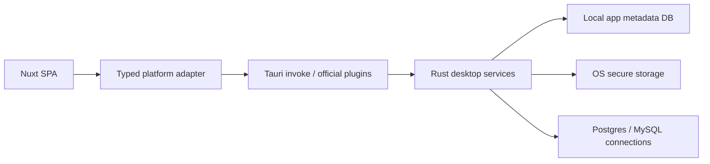

# Tauri 2 Desktop Migration Plan

## Status

Planning only. No Tauri implementation has been added yet.

## Goal

Replace the current Electron desktop shell with a Tauri 2 desktop app while keeping the existing Nuxt 3 frontend and preserving the web product.

This document defines:

- the desktop architecture to build
- the migration strategy
- the checklist before and during implementation
- a simple testing plan

## What Tauri 2 Changes

Based on the official Tauri 2 docs, the new desktop app should follow these rules:

- Tauri desktop code lives in `src-tauri/`
- the frontend is loaded from `devUrl` in development and `frontendDist` in production
- desktop-native features should use Tauri commands or official plugins, not ad-hoc global bridges
- access to native features should be scoped through Tauri 2 capabilities and permissions
- official plugins should be preferred for common desktop features; custom Rust commands should be used for HeraQ-specific behavior

## Repo Reality

The current repo is already a good fit for Tauri in some important ways:

- the frontend is already a Nuxt SPA with `ssr: false`
- the desktop shell is separated from most UI code
- the app already has a concept of web mode vs desktop mode

The main migration pressure points are:

- many frontend flows still call Nitro HTTP routes with relative `/api/...` paths
- desktop persistence currently depends on Electron-specific globals
- secrets and desktop storage need a stronger boundary

## Architecture Decision

### Desktop Target

The target desktop architecture will be:

- **Nuxt SPA frontend**
- **Tauri 2 desktop shell**
- **Rust command layer for desktop app services**
- **Rust-backed local persistence for app metadata**
- **OS-backed secure storage for secrets**
- **no embedded Express server in the desktop build**

That means the desktop app will not reproduce the old Electron model of:

- preload globals
- loopback HTTP server for the packaged UI
- Electron IPC per feature area

### Web Target

The web app stays separate:

- Nuxt SPA remains the UI
- Nitro routes remain the web/backend path
- web mode can keep using HTTP APIs

### Migration Rule

We will not directly wire the frontend to Tauri everywhere.

Instead, we will add a typed platform/service boundary in the frontend so the app can choose between:

- a **web adapter** for browser + Nitro
- a **desktop adapter** for Tauri commands/plugins

This keeps the Nuxt UI reusable and prevents another Electron-style global bridge from spreading across the app.

## Proposed Desktop Data Flow



## Folder Plan

### Frontend

We will add a new frontend boundary similar to:

```text
core/platform/
  index.ts
  types.ts
  runtime.ts
  web/
    persistence.ts
    database.ts
    shell.ts
  tauri/
    persistence.ts
    database.ts
    shell.ts
core/api/
  workspace.ts
  connections.ts
  query.ts
  metadata.ts
```

Purpose:

- remove direct `window.*Api` usage
- remove direct Electron type imports from shared code
- centralize the runtime switch between web and desktop

### Tauri

We will add:

```text
src-tauri/
  Cargo.toml
  tauri.conf.json
  capabilities/
    default.json
  src/
    main.rs
    lib.rs
    commands/
      mod.rs
      workspace.rs
      connection.rs
      tab_view.rs
      quick_query.rs
      row_query_file.rs
      window.rs
      database.rs
    services/
      mod.rs
      persistence/
      secrets/
      database/
      shell/
    state/
      mod.rs
      app_state.rs
```

## Tauri 2 Pieces To Use

### Official Plugins

These are the plugins I plan to use:

- `@tauri-apps/plugin-dialog` for native open/save/message dialogs
- `@tauri-apps/plugin-fs` for file access where plugin APIs are enough
- `@tauri-apps/plugin-shell` for opening external URLs and controlled command execution if needed
- `@tauri-apps/plugin-window-state` for restoring window size and position
- `@tauri-apps/plugin-updater` for desktop updates
- `@tauri-apps/plugin-store` only for non-sensitive settings if a simple key-value store is useful

### Capabilities

We will use Tauri 2 capability files to explicitly allow only the desktop features we need.

Initial capability scope should be limited to:

- dialog access
- selected filesystem access
- external URL opening
- window state persistence
- updater access
- custom app commands for workspace, connection, query, and metadata flows

### Custom Rust Commands

We should use custom Rust commands for HeraQ-specific logic:

- workspace CRUD
- connection CRUD
- query history and tab persistence
- row query file persistence
- database health checks
- schema/metadata/query operations

## Persistence Plan

### App Metadata

For desktop mode, app metadata should move out of IndexedDB and Electron file stores.

Use a Rust-owned local database for:

- workspaces
- connections
- workspace state
- tab views
- quick query logs
- row query files

Preferred direction:

- use a structured local SQLite-backed layer owned by Rust

### Secrets

Secrets should not live in localStorage or general app metadata files.

Use OS-backed secure storage for:

- database passwords
- connection strings with credentials
- AI provider API keys if desktop mode needs them persisted

### Why

This fixes one of the main problems in the old desktop architecture:

- the frontend currently owns too much persistence and too much secret material

## Database Access Plan

### Target Direction

For desktop mode, database operations should move behind Rust commands instead of desktop HTTP routes.

That means the desktop app should eventually stop relying on:

- packaged local `/api/*` HTTP calls
- an embedded Node/Nitro server

### Practical Migration Strategy

This should be done in phases:

1. Introduce a typed frontend API boundary.
2. Move desktop persistence and shell features to Tauri first.
3. Port database health-check, metadata, and query flows from desktop HTTP routes to Rust commands.
4. Keep Nitro only for the web app.

### Important Choice

I do **not** plan to use Tauri SQL plugin as the main abstraction for HeraQ's external database feature set.

Reason:

- HeraQ needs app-specific connection management, SSH/SSL handling, metadata exploration, query streaming, and richer domain responses than a thin frontend SQL bridge usually provides.

The SQL plugin may still be useful for simple local app data, but external DB features should stay behind Rust-owned services.

## Nuxt Integration Plan

### Development

Tauri dev should run against the Nuxt dev server.

Planned direction:

- Tauri `beforeDevCommand` starts the Nuxt dev server
- Tauri `devUrl` points to the Nuxt dev URL

### Production

Desktop production should load bundled static frontend assets.

Planned direction:

- create a dedicated desktop frontend build output
- point Tauri `frontendDist` to that output
- avoid embedding a localhost server in the packaged app

## Migration Checklist

### Phase 0: Planning

- [x] Review old Electron architecture
- [x] Read Tauri 2 docs and plugin/capability guidance
- [x] Define target architecture before implementation

### Phase 1: Tauri Scaffold

- [ ] Add `src-tauri/`
- [ ] Add Tauri 2 CLI and Rust toolchain requirements to project docs
- [ ] Create `tauri.conf.json`
- [ ] Add capability file with minimum required permissions
- [ ] Add base Tauri window bootstrap

### Phase 2: Frontend Boundary

- [ ] Create `core/platform` typed runtime boundary
- [ ] Create a Tauri adapter and a web adapter
- [ ] Remove direct Electron type imports from shared frontend code
- [ ] Remove direct `window.*Api` usage from stores and composables
- [ ] Start moving `/api/*` calls behind typed frontend service modules

### Phase 3: Desktop Persistence

- [ ] Implement Rust persistence for workspaces
- [ ] Implement Rust persistence for connections
- [ ] Implement Rust persistence for workspace state
- [ ] Implement Rust persistence for tab views
- [ ] Implement Rust persistence for quick query logs
- [ ] Implement Rust persistence for row query files
- [ ] Move secrets to OS-backed secure storage

### Phase 4: Desktop Database Flows

- [ ] Implement desktop health-check command
- [ ] Implement desktop metadata command
- [ ] Implement desktop query execution command
- [ ] Implement desktop export/import file flows
- [ ] Implement SSH/SSL handling in Rust desktop services

### Phase 5: Cleanup

- [ ] Remove Electron build scripts
- [ ] Remove Electron package and preload bridge
- [ ] Remove Electron-only runtime branches
- [ ] Update README and architecture docs

## Simple Testing Plan

This is intentionally small and practical for the first Tauri milestone.

### Automated

- keep existing `Vitest` and `Nuxt` tests for frontend logic
- add `cargo test` for Rust command/service modules
- add a small desktop smoke test layer after the shell boots

### First Rust Tests

We should add Rust unit tests for:

- workspace persistence
- connection persistence
- secret storage wrapper behavior
- one database health-check command
- one query execution command with mocked or test DB inputs

### Simple Manual Smoke Tests

After the first implementation pass, verify:

- [ ] `tauri dev` opens the Nuxt app successfully
- [ ] creating a workspace persists across restart
- [ ] creating a connection persists across restart
- [ ] secrets are not stored in browser localStorage or IndexedDB
- [ ] a dialog-based file open/save flow works
- [ ] one external link opens through the shell plugin
- [ ] one database health check succeeds
- [ ] one simple query succeeds

### E2E Direction

For later phases:

- keep Playwright for web behavior where useful
- add desktop E2E only after the Tauri shell and command boundary stabilize

## What We Will Not Do First

To keep the first implementation controlled, the initial Tauri migration should **not** try to finish everything at once.

Not first:

- full database feature parity
- updater and auto-update polish
- multi-window parity with Electron
- tray/menu parity
- full desktop E2E coverage

## Risks

- the biggest migration cost is not the window shell; it is replacing frontend dependence on `/api/*` and Electron globals
- database features are broad, so command design must be consistent early
- capability scoping must stay tight or the desktop app will become hard to audit

## Recommended First Delivery

The first Tauri milestone should aim for:

- app boots in Tauri
- frontend uses a typed desktop boundary
- workspace + connection persistence works
- one health-check command works
- one query command works

That gives a real vertical slice without trying to port the whole database IDE in one pass.

## References

Official docs reviewed through Context7:

- [Tauri v2 app structure and capabilities](https://v2.tauri.app/es/security/capabilities)
- [Tauri frontend build configuration](https://v2.tauri.app/start/frontend/sveltekit)
- [Tauri config reference for `frontendDist`](https://v2.tauri.app/zh-cn/reference/config)
- [Calling Rust commands from the frontend](https://v2.tauri.app/develop/calling-rust)
- [Tauri CLI reference](https://v2.tauri.app/reference/cli)
- [Tauri development guide](https://v2.tauri.app/fr/develop)
- [Tauri configuration files](https://v2.tauri.app/develop/configuration-files)
- [Tauri tests / E2E guidance](https://v2.tauri.app/es/develop/tests)
