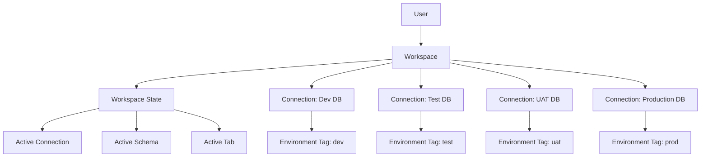

# OrcaQ Overview

**Document Type:** Business Analysis - Product Overview  
**Product:** OrcaQ  
**Last Updated:** 2026-04-23

---

## 1. Product Summary

OrcaQ is a friendly database editor and database client for managing database work across projects, environments, and platforms. It supports multiple database engines and is designed for both technical users and non-technical users who need safe, understandable access to database workflows.

The core product model is simple:

- A **workspace** represents a project or business context.
- A **connection** represents a database target inside that workspace.
- An **environment tag** explains what kind of environment the connection belongs to, such as `dev`, `test`, `uat`, or `prod`.
- **Workspace state** remembers the user's active connection, schema, and tab context so the project can be reopened with useful continuity.

## Related Documents

- [Product Brief](./PRODUCT_BRIEF.md)
- [Requirements](./REQUIREMENTS.md)
- [User Flows](./USER_FLOWS.md)
- [Workspace Module](./modules/WORKSPACE.md)
- [Connection Module](./modules/CONNECTION.md)
- [Role & Permission Module](./modules/ROLE_PERMISSION.md)

## 2. Product Scope

| Scope Area             | Description                                                                 |
| ---------------------- | --------------------------------------------------------------------------- |
| Database client        | Connect to supported database engines and execute database workflows        |
| Database editor        | Browse schemas, inspect table data, run SQL, and edit data where supported  |
| Project organization   | Group database work by workspace instead of a flat list of connections      |
| Environment awareness  | Use connection-level tags to identify dev, test, uat, prod, and custom envs |
| Multi-platform access  | Run through web, npx, Docker, or desktop app                                |
| Friendly user approach | Make database context understandable beyond backend-only users              |

## 3. Supported Users

| User Type           | Main Need                                                             |
| ------------------- | --------------------------------------------------------------------- |
| Backend engineer    | Manage environments, run SQL, inspect schemas, and update data safely |
| Full-stack engineer | Validate app behavior through database state across environments      |
| QA engineer         | Verify data in dev, test, and uat without losing environment context  |
| Data analyst        | Query and inspect data with a practical SQL workflow                  |
| Support operator    | Look up production or customer data with clear guardrails             |
| Product user        | Understand database information through guided, lower-risk workflows  |
| Admin user          | Organize project workspaces, connections, and environment tags        |

## 4. Supported Platforms

| Platform    | Business Purpose                                     | Notes                                                 |
| ----------- | ---------------------------------------------------- | ----------------------------------------------------- |
| Web app     | Browser-based database client experience             | No desktop file picker                                |
| npx         | Fast local startup from terminal                     | Useful for quick evaluation and local use             |
| Docker      | Self-hosted service for repeatable deployment        | Useful for teams and infrastructure-managed setups    |
| Desktop app | Native app experience with desktop-only capabilities | SQLite file connections are available only on desktop |

## 5. Supported Databases

| Database   | Business Role                                      |
| ---------- | -------------------------------------------------- |
| PostgreSQL | Primary advanced workflow support                  |
| MySQL      | Common web application database support            |
| MariaDB    | MySQL-family database support                      |
| Oracle     | Enterprise database support                        |
| SQLite     | Local file database support in the desktop runtime |

Feature depth can vary by database engine. Unsupported engine-specific workflows should be hidden or explained clearly to the user.

## 6. High-Level Domain Model

## 7. Primary Modules

| Module                                              | Purpose                                                                 |
| --------------------------------------------------- | ----------------------------------------------------------------------- |
| [Workspace](./modules/WORKSPACE.md)                 | Project-level container for database work                               |
| [Workspace State](./modules/WORKSPACE_STATE.md)     | Persisted user context inside a workspace and connection                |
| [Connection](./modules/CONNECTION.md)               | Database access configuration and health-check workflow                 |
| [Env Tags](./modules/ENV_TAGS.md)                   | Environment labels and strict-mode safety context for connections       |
| Schema Explorer                                     | Database object browsing                                                |
| [Quick Query](./modules/QUICK_QUERY.md)             | Table data viewing, filtering, and editing                              |
| [Raw Query](./modules/RAW_QUERY.md)                 | SQL editor and result workflow                                          |
| [Tab Container](./modules/TAB_CONTAINER.md)         | Main workbench tabs and active tab state                                |
| [ERD Diagram](./modules/ERD.md)                     | Visual relationship exploration                                         |
| [Agent](./modules/AGENT.md)                         | AI-assisted database workflow and chat history                          |
| [Instance Insights](./modules/INSTANCE_INSIGHTS.md) | Database activity, state, configuration, and replication visibility     |
| [Role & Permission](./modules/ROLE_PERMISSION.md)   | Database users, roles, grants, revokes, and permission visibility       |
| [Global Settings](./modules/GLOBAL_SETTINGS.md)     | User preferences for editor, query, appearance, AI, and related modules |

## 8. Main User Journey

```mermaid
flowchart LR
    Start["Open OrcaQ"] --> SelectWorkspace["Select or create workspace"]
    SelectWorkspace --> AddConnection["Create connection"]
    AddConnection --> AssignTag["Assign env tag"]
    AssignTag --> TestConnection["Test connection"]
    TestConnection --> OpenConnection["Open connection"]
    OpenConnection --> Explore["Explore schema or data"]
    Explore --> Query["Run query or edit data"]
    Query --> SaveState["Persist workspace state"]
```

## 9. Key BA Principles

- The app should speak in project and environment language, not only database-driver language.
- Workspace and connection context should always be clear enough to prevent wrong-environment mistakes.
- Production and strict-mode environments should require more deliberate user confirmation.
- Non-technical users should be able to identify where they are and what they are doing without understanding every database detail.
- Technical users should still have efficient access to direct SQL, schema inspection, and advanced database workflows.
