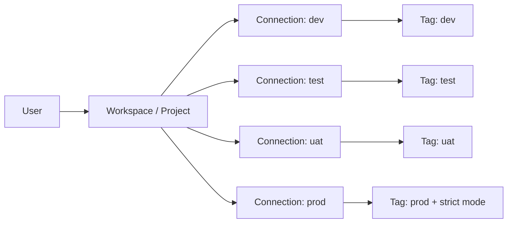

# OrcaQ BA Documentation

**Document Type:** Business Analysis Documentation  
**Product:** OrcaQ  
**Last Updated:** 2026-04-23

This folder contains business analysis documentation for OrcaQ, a friendly multi-platform database editor and client for technical and non-technical users.

## Document Map

| Document                            | Purpose                                                                                                       |
| ----------------------------------- | ------------------------------------------------------------------------------------------------------------- |
| [Overview](./OVERVIEW.md)           | Product overview, platform scope, domain model, main modules, and primary user journey                        |
| [Product Brief](./PRODUCT_BRIEF.md) | Product positioning, audience, value proposition, supported platforms, and product scope                      |
| [Requirements](./REQUIREMENTS.md)   | Business goals, functional requirements, business rules, non-functional requirements, and acceptance criteria |
| [User Flows](./USER_FLOWS.md)       | Workspace, connection, environment tag, query, and schema exploration flows                                   |

## Module Detail Documents

| Module            | Document                                                   |
| ----------------- | ---------------------------------------------------------- |
| Workspace         | [Workspace Module](./modules/WORKSPACE.md)                 |
| Workspace State   | [Workspace State Module](./modules/WORKSPACE_STATE.md)     |
| Connection        | [Connection Module](./modules/CONNECTION.md)               |
| Environment Tags  | [Environment Tags Module](./modules/ENV_TAGS.md)           |
| Quick Query       | [Quick Query Module](./modules/QUICK_QUERY.md)             |
| Raw Query         | [Raw Query Module](./modules/RAW_QUERY.md)                 |
| Tab Container     | [Tab Container Module](./modules/TAB_CONTAINER.md)         |
| ERD Diagram       | [ERD Module](./modules/ERD.md)                             |
| Agent             | [Agent Module](./modules/AGENT.md)                         |
| Instance Insights | [Instance Insights Module](./modules/INSTANCE_INSIGHTS.md) |
| Role & Permission | [Role & Permission Module](./modules/ROLE_PERMISSION.md)   |
| Global Settings   | [Global Settings Module](./modules/GLOBAL_SETTINGS.md)     |

## Reading Paths

| Reader Goal                | Start Here                                                                                                                                                  |
| -------------------------- | ----------------------------------------------------------------------------------------------------------------------------------------------------------- |
| Understand product scope   | [Overview](./OVERVIEW.md) -> [Product Brief](./PRODUCT_BRIEF.md) -> [Requirements](./REQUIREMENTS.md)                                                       |
| Understand core model      | [Workspace](./modules/WORKSPACE.md) -> [Connection](./modules/CONNECTION.md) -> [Environment Tags](./modules/ENV_TAGS.md)                                   |
| Understand user workbench  | [Tab Container](./modules/TAB_CONTAINER.md) -> [Quick Query](./modules/QUICK_QUERY.md) -> [Raw Query](./modules/RAW_QUERY.md)                               |
| Understand admin workflows | [Role & Permission](./modules/ROLE_PERMISSION.md) -> [Instance Insights](./modules/INSTANCE_INSIGHTS.md) -> [Global Settings](./modules/GLOBAL_SETTINGS.md) |
| Understand AI workflows    | [Agent](./modules/AGENT.md) -> [Raw Query](./modules/RAW_QUERY.md) -> [Quick Query](./modules/QUICK_QUERY.md)                                               |

## Product Summary

OrcaQ is a database editor and database client that helps users connect to multiple database engines, organize work by workspace, and manage project environments such as dev, test, uat, and prod through connection-level environment tags.

The product is designed for a wider audience than backend engineers only. It should be approachable for backend engineers, full-stack developers, data analysts, QA engineers, product operators, support teams, and non-technical users who need controlled access to database workflows.

## Core Concept

## BA Assumptions

- A workspace represents a project or business context.
- A workspace can contain multiple database connections.
- Each connection can represent a project environment such as local, dev, test, uat, or prod.
- Environment tags help users quickly identify the risk and purpose of a connection.
- Production-like connections should be visually clear and can use strict-mode confirmation before risky actions.
- The application should be usable across web, terminal/npx, Docker, and desktop app distribution paths.
