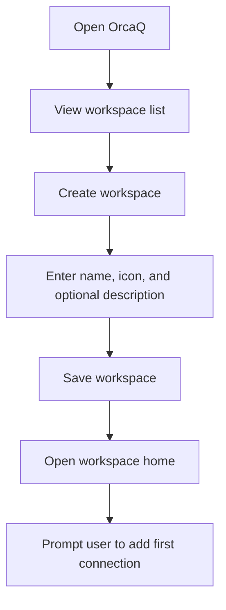
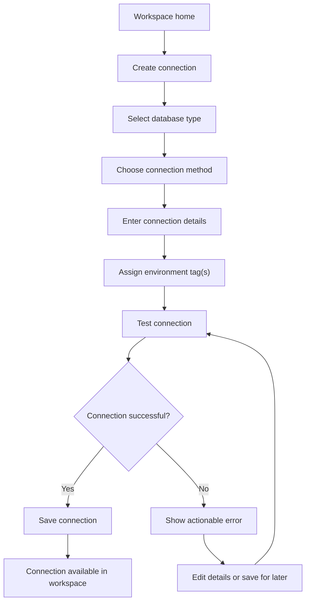
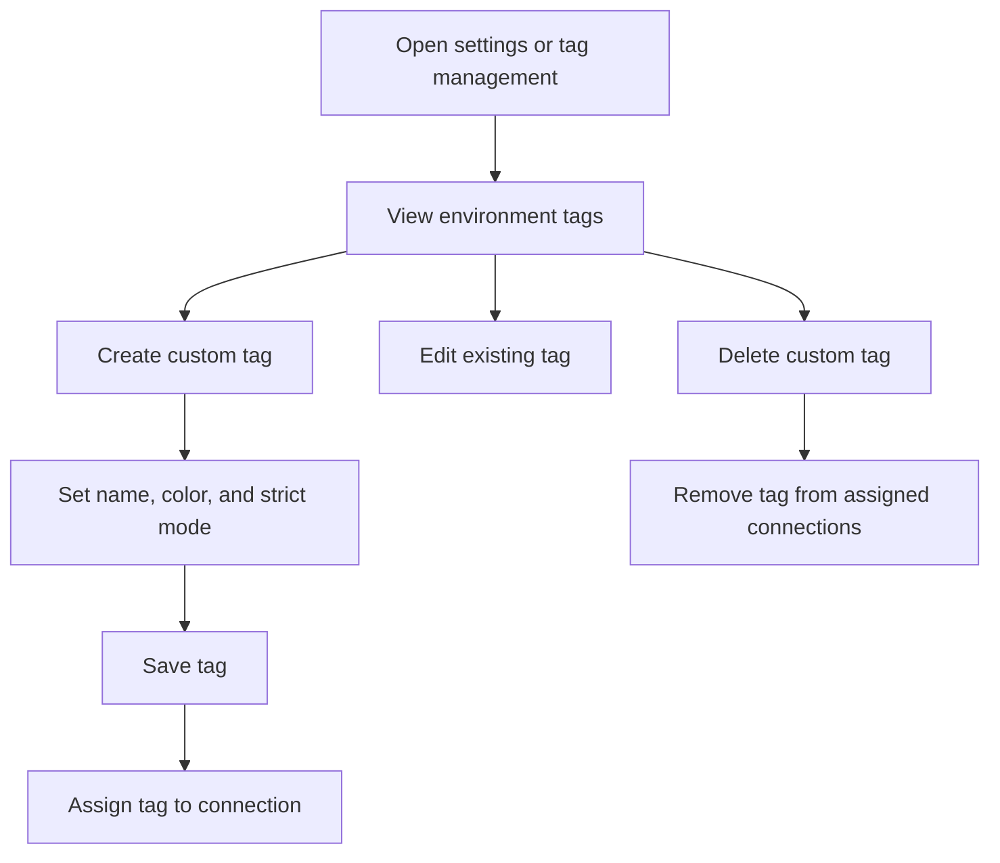
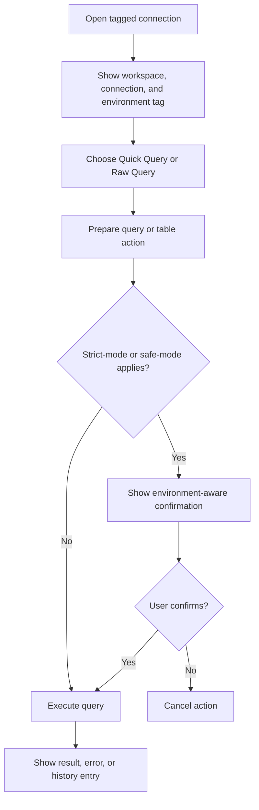
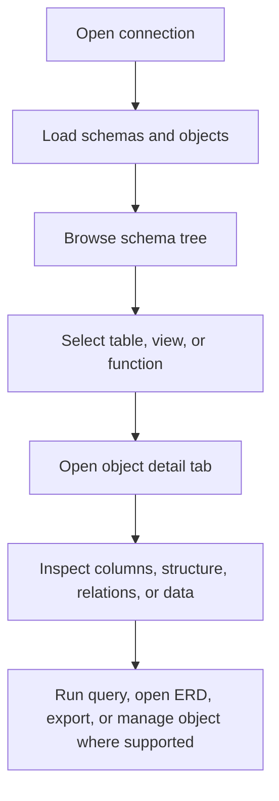
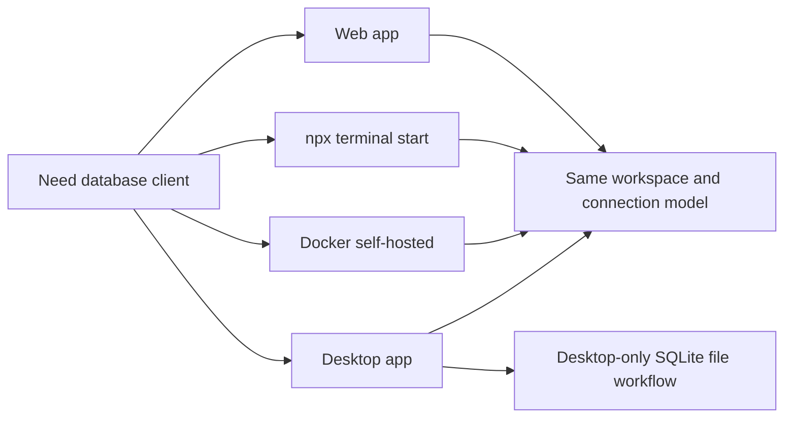
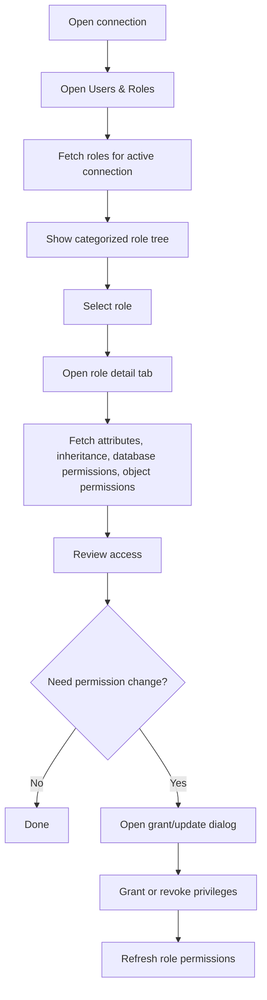

# OrcaQ User Flows

**Document Type:** Business Analysis - User Flows  
**Product:** OrcaQ  
**Last Updated:** 2026-04-23

---

## Related Documents

- [Overview](./OVERVIEW.md)
- [Requirements](./REQUIREMENTS.md)
- [Workspace Module](./modules/WORKSPACE.md)
- [Connection Module](./modules/CONNECTION.md)
- [Quick Query Module](./modules/QUICK_QUERY.md)
- [Raw Query Module](./modules/RAW_QUERY.md)
- [Role & Permission Module](./modules/ROLE_PERMISSION.md)

## 1. Workspace Setup Flow

**Goal:** User creates a workspace that represents a project or business context.

### Business Notes

- A workspace should use user-friendly project language.
- The empty workspace state should guide users to create a connection.
- Workspace naming should not require database-specific terminology.

## 2. Connection Setup Flow

**Goal:** User creates a database connection inside a workspace.

### Business Notes

- Connection names should be understandable to non-backend users.
- Suggested naming pattern: `{project or system} - {environment}`.
- Connection test failure should not destroy user-entered details.
- Tags should be assignable during connection setup, not only after save.

## 3. Environment Tag Management Flow

**Goal:** Admin or project owner manages environment labels used across connections.

### Business Notes

- Default tags are local, dev, test, uat, and prod.
- System tags should remain available for consistent onboarding.
- Strict-mode tags should communicate higher risk.
- Production should be visibly different from lower-risk environments.

## 4. Environment-Aware Query Flow

**Goal:** User runs a query while remaining aware of the selected project and environment.

### Business Notes

- The user should not need to remember which environment they selected.
- The app should keep environment context visible near risky actions.
- Warnings should be direct and specific, especially for production.

## 5. Schema Exploration Flow

**Goal:** User explores database structure without needing to write SQL first.

### Business Notes

- Schema browsing is important for non-technical and semi-technical users.
- Object names and actions should be presented clearly.
- Unsupported database-specific actions should be hidden or explained.

## 6. Multi-Platform Access Flow

**Goal:** User starts OrcaQ from the platform that fits their situation.

### Business Notes

- The product language should stay consistent across all platforms.
- Platform limitations should be documented and visible.
- Desktop can support local file workflows that browser-based runtimes cannot support.

## 7. Role and Permission Review Flow

**Goal:** Admin or technical user reviews database roles and adjusts permissions.

### Business Notes

- Role and permission workflows require an active connection.
- Create user should be disabled with a clear reason when the current role lacks privilege.
- Grant/revoke actions should be treated as administrative changes.
- Production-tagged connections may need stricter confirmation in future releases.
