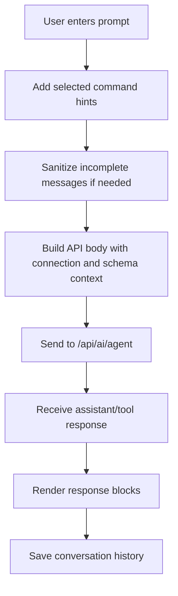

# Agent Module

**Document Type:** Business Analysis - Module Detail  
**Module:** Agent  
**Last Updated:** 2026-04-23

---

## Related Documents

- [Overview](../OVERVIEW.md)
- [Connection Module](./CONNECTION.md)
- [Raw Query Module](./RAW_QUERY.md)
- [Quick Query Module](./QUICK_QUERY.md)
- [ERD Module](./ERD.md)
- [Global Settings Module](./GLOBAL_SETTINGS.md)

## 1. Module Purpose

The Agent module provides AI-assisted database work inside OrcaQ. Users can ask database questions in natural language, receive generated SQL, inspect results, request explanations, and use assistant workflows without leaving the workspace.

Business meaning: the agent lowers the barrier to database work while keeping the application responsible for context, rendering, and safety gates.

## 2. Business Value

| Value                     | Description                                                    |
| ------------------------- | -------------------------------------------------------------- |
| Lower SQL barrier         | Non-technical users can ask questions in natural language      |
| Faster technical workflow | Developers can generate, explain, and debug SQL faster         |
| Context-aware assistance  | Agent receives current connection and schema snapshots         |
| Reusable history          | Conversations are saved and scoped to workspace context        |
| Safer AI behavior         | App-side approval and rendering keep control outside the model |

## 3. Design Principle

The product principle is:

```text
Brain belongs to the app, not the AI.
```

The AI can assist with reasoning and generation, but OrcaQ controls:

- Current workspace and connection context
- Schema snapshots sent to the API
- Tool rendering blocks
- Approval behavior
- Conversation persistence
- UI state and history management

## 4. Main Capabilities

| Capability           | Description                                                         |
| -------------------- | ------------------------------------------------------------------- |
| Chat with database   | User sends natural-language prompts to `/api/ai/agent`              |
| Schema-aware context | Active schema snapshots are included in the agent request           |
| Connection context   | Current connection string and database type are included            |
| Command hints        | Selected command options can prepend structured hints to a prompt   |
| Reasoning toggle     | User can control whether reasoning blocks are sent/displayed        |
| Chat history         | Conversations are saved with title, preview, provider, model, dates |
| Workspace scope      | Histories can be filtered by current workspace                      |
| Attachment panel     | UI can expose supporting files or context through attachment panel  |
| Block rendering      | Agent responses render as markdown, code, tools, ERD, table, etc.   |
| Approval responses   | Chat can continue automatically after approval response completion  |

## 5. Conversation Flow



## 6. History Model

Agent history sessions include:

| Field         | Business Meaning                              |
| ------------- | --------------------------------------------- |
| `id`          | Conversation identifier                       |
| `title`       | Conversation title, usually from first prompt |
| `preview`     | Short preview from latest assistant text      |
| `createdAt`   | Conversation creation timestamp               |
| `updatedAt`   | Latest conversation update timestamp          |
| `provider`    | AI provider used                              |
| `model`       | AI model used                                 |
| `messages`    | Sanitized chat messages                       |
| `workspaceId` | Optional workspace scope                      |

Current history retention is capped to the most recent 40 sessions.

## 7. Agent State

Persisted agent UI state includes:

- Selected agent navigation node
- Draft reasoning display preference
- Active history ID
- Attachment panel visibility
- Conversation histories

## 8. Business Rules

| ID        | Rule                                                                             |
| --------- | -------------------------------------------------------------------------------- |
| AGT-BR-01 | Agent requests should include current database connection context when available |
| AGT-BR-02 | Agent requests should include active schema snapshots when available             |
| AGT-BR-03 | Conversation history should be sanitized before save                             |
| AGT-BR-04 | Conversation title should be generated from the first user prompt                |
| AGT-BR-05 | Histories should be scoped to current workspace when workspace ID exists         |
| AGT-BR-06 | Reasoning display should be user-configurable                                    |
| AGT-BR-07 | Incomplete persisted messages should be repaired before sending new messages     |
| AGT-BR-08 | Potentially risky AI-generated database actions should require user approval     |

## 9. UX Requirements

- Agent should support both technical and non-technical language.
- Generated SQL should be visible, copyable, and reviewable.
- Tool outputs should be structured blocks, not plain unstructured text only.
- Conversation history should be easy to resume, rename, and delete.
- Users should understand which workspace and connection the agent is using.

## 10. Acceptance Criteria

- Given a user sends a prompt, when a connection is selected, then the agent request includes connection and database type.
- Given active schemas are loaded, when the agent request is sent, then schema snapshots are included.
- Given a conversation has a user prompt, when messages are saved, then a history item is created with title and preview.
- Given the user switches workspace, when viewing histories, then workspace-scoped histories are filtered appropriately.
- Given messages are incomplete, when sending another message, then the app sanitizes messages first.

## 11. Open Questions

| ID     | Question                                                                     |
| ------ | ---------------------------------------------------------------------------- |
| AGT-Q1 | Should agent be disabled by default until an API key/provider is configured? |
| AGT-Q2 | Should agent-generated mutation SQL always require strict approval?          |
| AGT-Q3 | Should non-technical users receive simplified agent response modes?          |
| AGT-Q4 | Should agent histories be exportable as audit evidence?                      |
