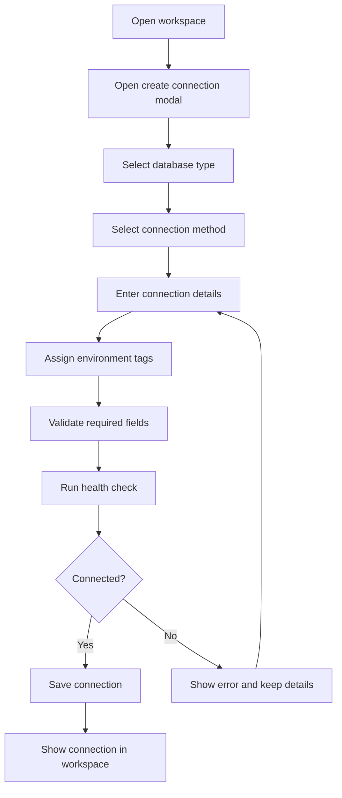
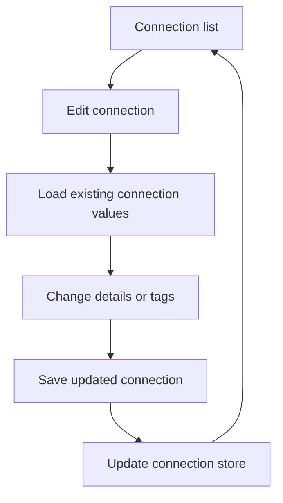

# Connection Module

**Document Type:** Business Analysis - Module Detail  
**Module:** Connection  
**Last Updated:** 2026-04-23

---

## Related Documents

- [Overview](../OVERVIEW.md)
- [Workspace Module](./WORKSPACE.md)
- [Environment Tags Module](./ENV_TAGS.md)
- [Role & Permission Module](./ROLE_PERMISSION.md)
- [Instance Insights Module](./INSTANCE_INSIGHTS.md)

## 1. Module Purpose

The Connection module manages database access targets inside a workspace. A connection usually represents one project environment, such as `local`, `dev`, `test`, `uat`, or `prod`.

Business meaning: if a workspace is the project, a connection is the database environment for that project.

## 2. Business Value

| Value                 | Description                                                                |
| --------------------- | -------------------------------------------------------------------------- |
| Environment mapping   | Users can map project environments to separate connections                 |
| Multi-database access | Teams can work with PostgreSQL, MySQL, MariaDB, Oracle, and SQLite         |
| Safer setup           | Health checks validate connection details before a new connection is saved |
| Flexible input        | Users can connect by URL string, structured form, or file where supported  |
| Clear project context | Connections are scoped to one workspace                                    |

## 3. Current Data Model

```ts
interface Connection {
  id: string;
  workspaceId: string;
  name: string;
  type: DatabaseClientType;
  method: EConnectionMethod;
  connectionString?: string;
  host?: string;
  port?: string;
  username?: string;
  password?: string;
  database?: string;
  serviceName?: string;
  filePath?: string;
  ssl?: ISSLConfig;
  ssh?: ISSHConfig;
  tagIds?: string[];
  createdAt: string;
  updatedAt?: string;
}
```

| Field              | Business Meaning                                 |
| ------------------ | ------------------------------------------------ |
| `id`               | Unique connection identifier                     |
| `workspaceId`      | Parent workspace                                 |
| `name`             | User-facing connection name                      |
| `type`             | Database engine                                  |
| `method`           | Connection method: string, form, or file         |
| `connectionString` | Full connection URL where used or generated      |
| `host`             | Database host for structured form connections    |
| `port`             | Database port                                    |
| `username`         | Database user                                    |
| `password`         | Database password                                |
| `database`         | Database name for most network databases         |
| `serviceName`      | Oracle service name target                       |
| `filePath`         | SQLite file path in desktop runtime              |
| `ssl`              | SSL configuration for network databases          |
| `ssh`              | SSH tunnel configuration for network databases   |
| `tagIds`           | Environment tags assigned to the connection      |
| `createdAt`        | Connection creation timestamp                    |
| `updatedAt`        | Last connection update timestamp, when available |

## 4. Supported Connection Methods

| Method   | Description                                            | Supported For                      |
| -------- | ------------------------------------------------------ | ---------------------------------- |
| `string` | User enters a database connection string               | PostgreSQL, MySQL, MariaDB, Oracle |
| `form`   | User enters host, port, username, password, and target | PostgreSQL, MySQL, MariaDB, Oracle |
| `file`   | User selects or enters a local SQLite database file    | SQLite in desktop runtime          |

## 5. Supported Database Types

| Database   | Connection Target Notes                                  |
| ---------- | -------------------------------------------------------- |
| PostgreSQL | Uses database name as structured target                  |
| MySQL      | Uses database name as structured target                  |
| MariaDB    | Uses database name as structured target                  |
| Oracle     | Uses `serviceName` as structured target                  |
| SQLite     | Uses desktop file path and generated `sqlite3://` string |

## 6. Create Connection Flow



## 7. Edit Connection Flow



## 8. Business Rules

| ID        | Rule                                                                                |
| --------- | ----------------------------------------------------------------------------------- |
| CON-BR-01 | A connection must belong to exactly one workspace                                   |
| CON-BR-02 | Connection name is required                                                         |
| CON-BR-03 | New network connections can use string or form method                               |
| CON-BR-04 | SQLite uses file method and is available only in desktop runtime                    |
| CON-BR-05 | Oracle structured form uses `serviceName`, not `database`                           |
| CON-BR-06 | New connections must pass health check before save                                  |
| CON-BR-07 | Editing an existing connection loads its current method, database type, and tag IDs |
| CON-BR-08 | A connection can have multiple environment tags                                     |
| CON-BR-09 | Failed health checks must preserve entered connection details                       |
| CON-BR-10 | Network connections can optionally include SSL and SSH configuration                |

## 9. Health Check Behavior

| Scenario                   | Expected Behavior                                               |
| -------------------------- | --------------------------------------------------------------- |
| Valid connection           | Show success state and allow save                               |
| Invalid credentials        | Show connection error without clearing the form                 |
| Unsupported SQLite runtime | Show desktop-only SQLite message                                |
| API or driver error        | Show returned message when available, otherwise generic failure |

The current health-check endpoint is:

```text
POST /api/managment-connection/health-check
```

## 10. Default UX Behavior

- New connection form starts with PostgreSQL selected.
- New connection name defaults to `my-abc-db`.
- New network connections support string and form methods.
- SQLite switches to file method.
- New connections default to the `dev` environment tag when the tag is available.
- Selecting a SQLite file can update the connection name from the file name if the default name is still unchanged.

## 11. Acceptance Criteria

- Given a user creates a connection in a workspace, when health check succeeds, then the connection is saved under that workspace.
- Given health check fails, when the user sees the error, then entered details remain available for correction.
- Given a user selects Oracle and form method, when entering structured target information, then the form asks for service name.
- Given a user selects SQLite outside desktop runtime, when testing or saving, then the app explains that SQLite file connections are desktop-only.
- Given a connection has tags, when it appears in the workspace, then users can understand its environment context.

## 12. Open Questions

| ID     | Question                                                                      |
| ------ | ----------------------------------------------------------------------------- |
| CON-Q1 | Should editing a connection require re-testing before save?                   |
| CON-Q2 | Should passwords be hidden, masked, or moved to a secure keychain by default? |
| CON-Q3 | Should connection names be auto-suggested from workspace and tag names?       |
| CON-Q4 | Should production connections require admin permission to create or edit?     |
