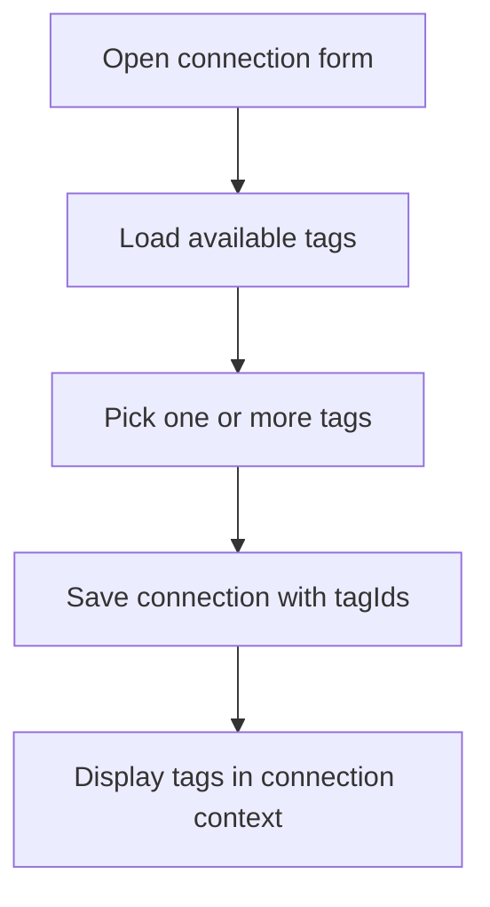
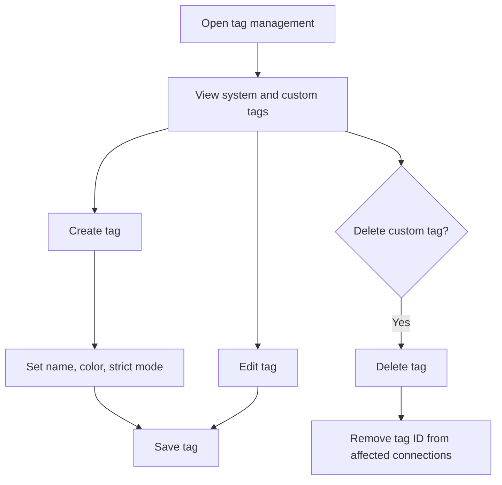
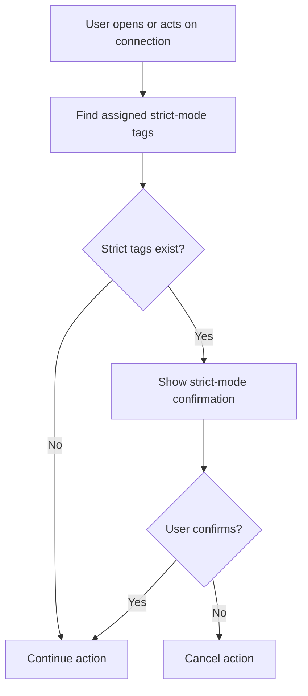

# Environment Tags Module

**Document Type:** Business Analysis - Module Detail  
**Module:** Environment Tags  
**Last Updated:** 2026-04-23

---

## Related Documents

- [Overview](../OVERVIEW.md)
- [Connection Module](./CONNECTION.md)
- [Quick Query Module](./QUICK_QUERY.md)
- [Role & Permission Module](./ROLE_PERMISSION.md)
- [Global Settings Module](./GLOBAL_SETTINGS.md)

## 1. Module Purpose

Environment Tags identify the purpose and risk level of a connection. They help users know whether they are working in `local`, `dev`, `test`, `uat`, `prod`, or another custom environment before they connect, query, or mutate data.

Business meaning: tags turn a technical database connection into a recognizable project environment.

## 2. Business Value

| Value                  | Description                                                          |
| ---------------------- | -------------------------------------------------------------------- |
| Environment visibility | Users can quickly identify the target environment                    |
| Production safety      | Strict-mode tags add confirmation before high-risk access/actions    |
| Friendly context       | Non-backend users can understand connection purpose from a short tag |
| Team convention        | Default tags create a shared vocabulary across workspaces            |
| Flexible organization  | Custom tags support organization-specific environments               |

## 3. Current Data Model

```ts
interface EnvironmentTag {
  id: string;
  name: string;
  color: TagColor;
  strictMode: boolean;
  createdAt: string;
  isSystem?: boolean;
}
```

| Field        | Business Meaning                                               |
| ------------ | -------------------------------------------------------------- |
| `id`         | Unique tag identifier                                          |
| `name`       | Short user-facing tag label                                    |
| `color`      | Visual color used by badges and pickers                        |
| `strictMode` | Whether the tag should trigger an additional confirmation flow |
| `createdAt`  | Tag creation timestamp                                         |
| `isSystem`   | Marks default seeded tags that users should not delete         |

## 4. Default System Tags

| Tag     | Color  | Strict Mode | Business Meaning                          |
| ------- | ------ | ----------- | ----------------------------------------- |
| `prod`  | Red    | Yes         | Production or production-like environment |
| `uat`   | Orange | No          | User acceptance testing environment       |
| `test`  | Yellow | No          | QA or test environment                    |
| `dev`   | Blue   | No          | Development environment                   |
| `local` | Green  | No          | Local developer machine or local database |

Default tags are seeded on first load when no environment tags exist.

## 5. Main Capabilities

| Capability         | Description                                                      |
| ------------------ | ---------------------------------------------------------------- |
| Load tags          | Load persisted tags and seed defaults when no tags exist         |
| Create custom tag  | Create a tag with name, color, and strict-mode flag              |
| Edit tag           | Update existing tag metadata                                     |
| Delete custom tag  | Delete non-system tags and remove them from affected connections |
| Assign tags        | Attach one or more tags to a connection                          |
| Display tag badges | Show tags through badges, color dots, and picker UI              |
| Strict-mode guard  | Ask for confirmation when a connection has strict-mode tags      |

## 6. Tag Creation Rules

| Rule                | Current Behavior                         |
| ------------------- | ---------------------------------------- |
| Name required       | Yes                                      |
| Maximum name length | 10 characters                            |
| Color required      | Yes                                      |
| Strict mode default | `false` for new custom tags              |
| System tag deletion | Not allowed by UI                        |
| Duplicate tag name  | Prevented by create/edit dialog behavior |

## 7. Tag Assignment Flow



## 8. Custom Tag Management Flow



## 9. Strict-Mode Flow



## 10. Business Rules

| ID        | Rule                                                                         |
| --------- | ---------------------------------------------------------------------------- |
| TAG-BR-01 | The system seeds `prod`, `uat`, `test`, `dev`, and `local` tags              |
| TAG-BR-02 | System tags should not be deleted by users                                   |
| TAG-BR-03 | `prod` is strict-mode by default                                             |
| TAG-BR-04 | A connection can have multiple tags                                          |
| TAG-BR-05 | Deleting a tag removes that tag ID from all affected connections             |
| TAG-BR-06 | Custom tag names should be short enough for compact UI badges                |
| TAG-BR-07 | Strict-mode confirmation should identify which strict tags are on connection |
| TAG-BR-08 | New connections default to `dev` when the `dev` tag exists                   |

## 11. UX Requirements

- Tags should be visible in connection lists and connection context.
- Tag colors should be easy to scan without relying only on color for meaning.
- Production tags should feel clearly higher-risk than normal tags.
- Tag picker should support quick assignment while creating or editing a connection.
- Tag management should explain when deleting a tag will affect existing connections.

## 12. Acceptance Criteria

- Given no tags exist, when the tag store loads, then the five default tags are created.
- Given a user creates a custom tag with valid data, when it is saved, then it appears in tag management and tag picker UI.
- Given a user deletes a custom tag assigned to connections, when deletion completes, then those connections no longer reference the deleted tag.
- Given a connection has a strict-mode tag, when strict-mode guard is checked, then the user must confirm before continuing.
- Given a user creates a new connection and the `dev` tag exists, when the form opens, then `dev` is selected by default.

## 13. Open Questions

| ID     | Question                                                                        |
| ------ | ------------------------------------------------------------------------------- |
| TAG-Q1 | Should strict mode guard only connection open actions, or also query mutations? |
| TAG-Q2 | Should admins be able to lock required tags per workspace?                      |
| TAG-Q3 | Should tag names be globally unique or workspace-specific?                      |
| TAG-Q4 | Should tag colors and strict mode be editable for system tags?                  |
| TAG-Q5 | Should custom tags support descriptions for non-technical users?                |
