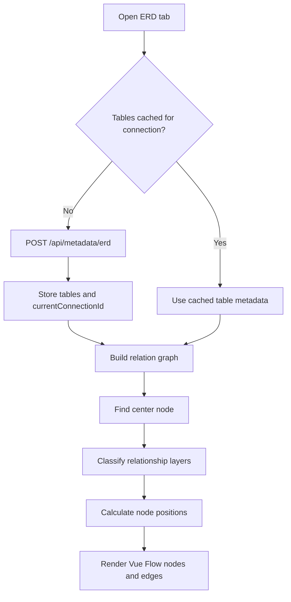
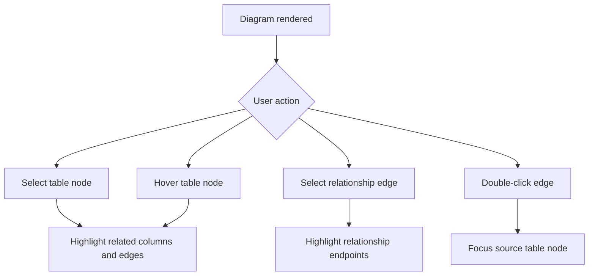

# ERD Module

**Document Type:** Business Analysis - Module Detail  
**Module:** ERD Diagram  
**Last Updated:** 2026-04-23

---

## Related Documents

- [Overview](../OVERVIEW.md)
- [Connection Module](./CONNECTION.md)
- [Tab Container Module](./TAB_CONTAINER.md)
- [Quick Query Module](./QUICK_QUERY.md)
- [Agent Module](./AGENT.md)

## 1. Module Purpose

The ERD module visualizes database table relationships so users can understand structure without reading foreign key definitions manually. It supports full-schema diagrams, focused relationship views, table nodes, relationship edges, minimap, background grid, and table/edge interaction.

Business meaning: ERD turns database structure into a visual map.

## 2. Business Value

| Value                 | Description                                                       |
| --------------------- | ----------------------------------------------------------------- |
| Faster understanding  | Users can see table relationships visually                        |
| Better onboarding     | New team members can learn unfamiliar schemas quickly             |
| Non-SQL exploration   | Non-technical users can inspect relationships without writing SQL |
| Impact awareness      | Developers can understand related tables before making changes    |
| Data model validation | Teams can inspect missing or unexpected relationships             |

## 3. Main Capabilities

| Capability             | Description                                                    |
| ---------------------- | -------------------------------------------------------------- |
| Load ERD metadata      | Fetch table metadata and foreign keys from `/api/metadata/erd` |
| Cache by connection    | Reuse ERD table metadata for the current connection            |
| Build relationship map | Convert table metadata into nodes and edges                    |
| Full diagram layout    | Build a full schema diagram from all tables                    |
| Focused layout         | Focus on a specific table and related edges                    |
| Node selection         | Highlight related columns and edges                            |
| Edge interaction       | Select or double-click relationship edges                      |
| Minimap                | Help users navigate large diagrams                             |
| Background grid        | Toggle visual grid style                                       |
| Fit and focus          | Fit view or focus specific nodes                               |

## 4. ERD Data Flow

## 5. Diagram Layout Logic

The ERD builder:

- Builds an undirected relationship graph from foreign keys.
- Calculates each table's connection degree.
- Finds a center node from the most connected table.
- Uses breadth-first layering from the center table.
- Places nodes by layer and table height.
- Places isolated tables outside the main relationship area.
- Creates table nodes and relationship edges for Vue Flow rendering.

## 6. Interaction Flow

## 7. Business Rules

| ID        | Rule                                                         |
| --------- | ------------------------------------------------------------ |
| ERD-BR-01 | ERD requires an active database connection                   |
| ERD-BR-02 | ERD metadata is cached per current connection                |
| ERD-BR-03 | Full ERD uses all available table metadata                   |
| ERD-BR-04 | Relationship edges are built from foreign key metadata       |
| ERD-BR-05 | Isolated tables should still appear in the diagram           |
| ERD-BR-06 | Selecting a table should highlight its related relationships |
| ERD-BR-07 | Large diagrams should support minimap and fit-view behavior  |

## 8. UX Requirements

- Tables should be readable even when the schema is large.
- Relationship highlighting should make source and target columns clear.
- The minimap should help users orient themselves.
- Empty or unsupported ERD states should clearly explain why no diagram is shown.
- Focused ERD views should help users inspect one table without full-schema noise.

## 9. Acceptance Criteria

- Given a connection has table metadata, when ERD opens, then tables render as nodes.
- Given tables have foreign keys, when ERD renders, then relationships render as edges.
- Given a table is selected, when it has relationships, then related columns and edges are highlighted.
- Given the current connection has cached ERD metadata, when reopening ERD, then the module can reuse cached metadata.
- Given isolated tables exist, when full ERD renders, then isolated tables still appear.

## 10. Open Questions

| ID     | Question                                                                  |
| ------ | ------------------------------------------------------------------------- |
| ERD-Q1 | Should users be able to save custom ERD layouts per workspace?            |
| ERD-Q2 | Should ERD support filtering by schema, table name, or relationship type? |
| ERD-Q3 | Should non-technical users get simplified table descriptions in ERD?      |
| ERD-Q4 | Should ERD export to image/PDF be part of the product scope?              |
