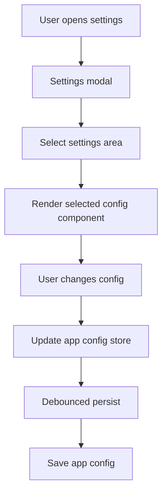

# Global Settings Module

**Document Type:** Business Analysis - Module Detail  
**Module:** Global Settings  
**Last Updated:** 2026-04-23

---

## Related Documents

- [Overview](../OVERVIEW.md)
- [Environment Tags Module](./ENV_TAGS.md)
- [Quick Query Module](./QUICK_QUERY.md)
- [Raw Query Module](./RAW_QUERY.md)
- [Agent Module](./AGENT.md)
- [Role & Permission Module](./ROLE_PERMISSION.md)

## 1. Module Purpose

Global Settings gives users one place to configure OrcaQ behavior, appearance, editor preferences, Quick Query safety, Agent provider settings, table display, environment tags, backup/restore, and desktop-only configuration where available.

Business meaning: settings let each user adapt OrcaQ to their workflow while keeping global behavior consistent across workspaces.

## 2. Settings Navigation

| Settings Area    | Purpose                                                      |
| ---------------- | ------------------------------------------------------------ |
| Appearance       | Theme and general visual preference                          |
| Editor           | Code editor font, theme, minimap, and indentation behavior   |
| Quick Query      | Quick Query behavior such as safe mode                       |
| Agent            | AI provider, model, API keys, and chat display configuration |
| Desktop          | Desktop-only settings when running the desktop app           |
| Environment Tags | Create and manage connection environment tags                |
| Backup & Restore | Export, import, restore, and reset data workflows            |

Desktop settings are shown only when the app is running in desktop runtime.

## 3. Main Config Areas

| Area             | Current State Examples                                                   |
| ---------------- | ------------------------------------------------------------------------ |
| Layout           | App layout size, history layout size, body size, sidebars, bottom panel  |
| Raw Query layout | Vertical/horizontal editor layout, editor/result/variable panel sizes    |
| Code editor      | Theme, font size, minimap, indentation                                   |
| Chat UI          | Chat font size, code font size, thinking animation style                 |
| Agent provider   | Selected provider, selected model, provider API keys                     |
| Quick Query      | Safe mode enabled/disabled                                               |
| Table appearance | Row height, font size, cell spacing, null order, accents, header styling |
| Space display    | Compact, default, or spacious density                                    |
| Custom layouts   | User-defined Raw Query layouts and persisted panel sizes                 |

## 4. Persisted App Config

Global settings are persisted through `appConfigStorage`.

Persisted values include:

- Layout sizes
- Body panel sizes
- Raw Query editor layout
- Raw Query panel sizes
- Code editor configs
- Chat UI configs
- Agent API key configs
- Selected AI provider and model
- Quick Query safe mode
- Space display
- Table appearance configs
- Custom layouts
- Active custom layout ID
- Custom layout sizes

## 5. Settings Flow

## 6. Layout Behavior

| Action                   | Behavior                                                     |
| ------------------------ | ------------------------------------------------------------ |
| Toggle activity bar pane | Collapse or restore primary sidebar width                    |
| Toggle second sidebar    | Collapse or restore right sidebar width                      |
| Resize layout            | Store new app panel sizes and history values                 |
| Toggle bottom panel      | Collapse or restore lower body panel                         |
| Apply preset layout      | Clear custom layout and use selected Raw Query layout preset |
| Apply custom layout      | Set active custom layout by ID                               |

## 7. Business Rules

| ID        | Rule                                                                    |
| --------- | ----------------------------------------------------------------------- |
| SET-BR-01 | Settings are global user preferences, not workspace-specific by default |
| SET-BR-02 | Desktop-only settings should appear only in desktop runtime             |
| SET-BR-03 | Settings changes should persist after app config has loaded             |
| SET-BR-04 | Persistence should be debounced to avoid excessive writes               |
| SET-BR-05 | Quick Query safe mode is controlled by global settings                  |
| SET-BR-06 | Custom Raw Query layout names should be unique                          |
| SET-BR-07 | Custom layout count should not exceed the configured maximum            |
| SET-BR-08 | Deleting the active custom layout should return to a preset layout      |
| SET-BR-09 | Table appearance reset should restore default table appearance configs  |
| SET-BR-10 | Code editor and chat UI configs should support reset to defaults        |

## 8. UX Requirements

- Settings should be discoverable from the global modal.
- Navigation labels should be user-facing and not implementation-specific.
- Desktop-only options should not appear in web runtime.
- Changes should apply quickly and persist without requiring manual save.
- Reset actions should be explicit enough to avoid accidental preference loss.

## 9. Acceptance Criteria

- Given the user opens settings, when they select a nav item, then the matching settings component appears.
- Given the app is not desktop runtime, when settings opens, then desktop-only nav item is hidden.
- Given the user changes Quick Query safe mode, when config persists, then Quick Query uses the new behavior.
- Given the user updates table appearance, when data grids render, then table display follows the configured values.
- Given the user deletes the active custom layout, when deletion completes, then Raw Query returns to the vertical preset.

## 10. Open Questions

| ID     | Question                                                                  |
| ------ | ------------------------------------------------------------------------- |
| SET-Q1 | Should some settings become workspace-level overrides in future releases? |
| SET-Q2 | Should API keys be moved to more secure platform-specific storage?        |
| SET-Q3 | Should settings support import/export independently from full backup?     |
| SET-Q4 | Should non-technical mode hide advanced settings by default?              |
