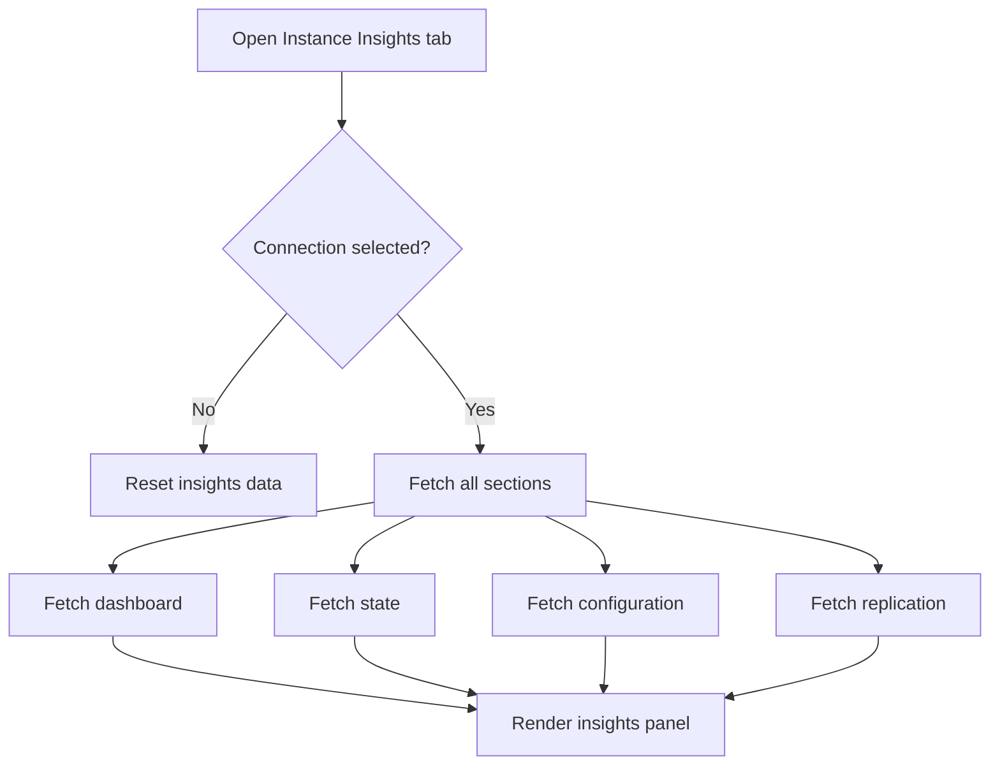
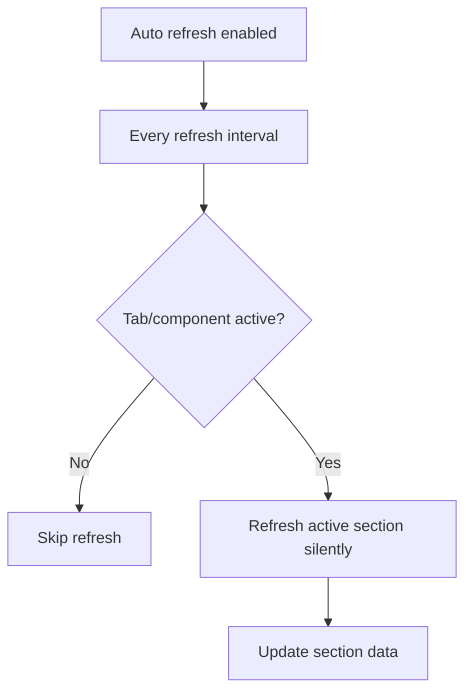
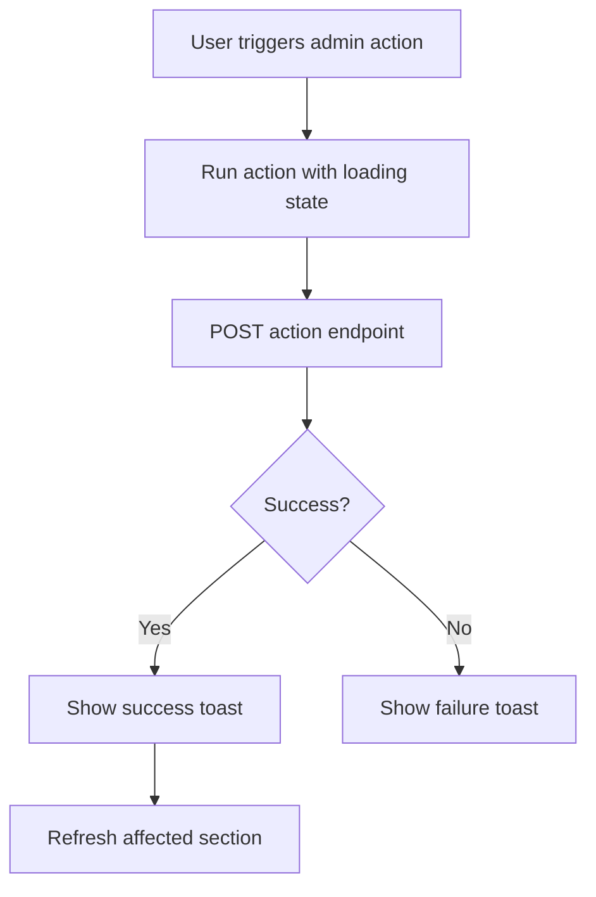

# Instance Insights Module

**Document Type:** Business Analysis - Module Detail  
**Module:** Instance Insights  
**Last Updated:** 2026-04-23

---

## Related Documents

- [Overview](../OVERVIEW.md)
- [Connection Module](./CONNECTION.md)
- [Environment Tags Module](./ENV_TAGS.md)
- [Role & Permission Module](./ROLE_PERMISSION.md)
- [Tab Container Module](./TAB_CONTAINER.md)

## 1. Module Purpose

Instance Insights gives users an operational view of a connected database instance. It shows database activity, state, configuration, and replication information, and supports selected administrative actions such as canceling queries, terminating connections, and managing replication slots.

Business meaning: Instance Insights helps users understand and react to database runtime health from inside OrcaQ.

## 2. Business Value

| Value                     | Description                                                        |
| ------------------------- | ------------------------------------------------------------------ |
| Operational visibility    | Users can see activity and state without external DBA tools        |
| Faster troubleshooting    | Active sessions, locks, and dashboard data help diagnose issues    |
| Safer admin actions       | Actions are explicit and provide success/failure feedback          |
| Reduced context switching | Users inspect runtime state in the same workspace and connection   |
| Production awareness      | Teams can monitor production-like connections with clearer context |

## 3. Main Sections

| Section       | Purpose                                              |
| ------------- | ---------------------------------------------------- |
| Activity      | Dashboard-level activity and performance summary     |
| State         | Active sessions, locks, or connection state          |
| Configuration | Database settings with searchable configuration list |
| Replication   | Replication status and replication slot management   |

## 4. Main Capabilities

| Capability            | Description                                                 |
| --------------------- | ----------------------------------------------------------- |
| Initial load          | Fetch dashboard, state, configuration, and replication data |
| Section refresh       | Refresh currently active section                            |
| Auto refresh          | Refresh active section every configured interval            |
| Silent refresh        | Refresh data without showing full loading state             |
| Configuration search  | Debounced search for database configuration settings        |
| Cancel query          | Cancel a running query by PID                               |
| Terminate connection  | Terminate a backend connection by PID                       |
| Drop replication slot | Drop a replication slot                                     |
| Toggle slot status    | Turn a replication slot on/off according to desired status  |
| Error handling        | Capture API or driver error messages for user display       |

## 5. Data Flow

## 6. Auto Refresh Flow

Current default refresh interval is 5000 milliseconds.

## 7. Admin Action Flow

## 8. API Areas

| Area          | Endpoint Pattern                              |
| ------------- | --------------------------------------------- |
| Dashboard     | `/api/instance-insights/dashboard`            |
| State         | `/api/instance-insights/state`                |
| Configuration | `/api/instance-insights/configuration`        |
| Replication   | `/api/instance-insights/replication`          |
| Cancel query  | `/api/instance-insights/cancel-query`         |
| Terminate     | `/api/instance-insights/terminate-connection` |
| Drop slot     | `/api/instance-insights/drop-slot`            |
| Toggle slot   | `/api/instance-insights/toggle-slot-status`   |

## 9. Business Rules

| ID        | Rule                                                              |
| --------- | ----------------------------------------------------------------- |
| INS-BR-01 | Instance Insights requires a selected connection                  |
| INS-BR-02 | No connection should reset displayed insights data                |
| INS-BR-03 | Initial load should fetch all sections                            |
| INS-BR-04 | Section changes should lazy-fetch missing section data            |
| INS-BR-05 | Auto refresh should refresh only the active section               |
| INS-BR-06 | Auto refresh should skip when the component is inactive           |
| INS-BR-07 | Admin actions should show success/failure feedback                |
| INS-BR-08 | Successful admin actions should refresh the affected data section |

## 10. UX Requirements

- Users should understand which connection insights are being shown.
- Loading and action states should be visible.
- Admin actions should be explicit and not feel accidental.
- Errors should mention permissions or connection issues when relevant.
- Auto refresh should not disrupt the user's current section.

## 11. Acceptance Criteria

- Given a connection is selected, when Instance Insights opens, then all insight sections are fetched.
- Given the active section is configuration, when search changes, then configuration refreshes with the debounced search value.
- Given auto refresh is enabled, when the interval fires and the tab is active, then the active section refreshes silently.
- Given cancel query succeeds, when action completes, then state refreshes.
- Given terminate connection succeeds, when action completes, then state and dashboard refresh.
- Given replication slot action succeeds, when action completes, then replication refreshes.

## 12. Open Questions

| ID     | Question                                                                  |
| ------ | ------------------------------------------------------------------------- |
| INS-Q1 | Should Instance Insights be PostgreSQL-only or support all engines later? |
| INS-Q2 | Should production actions require strict-mode confirmation?               |
| INS-Q3 | Should auto refresh pause when the browser tab is not visible?            |
| INS-Q4 | Should insights snapshots be exportable for incident reports?             |
