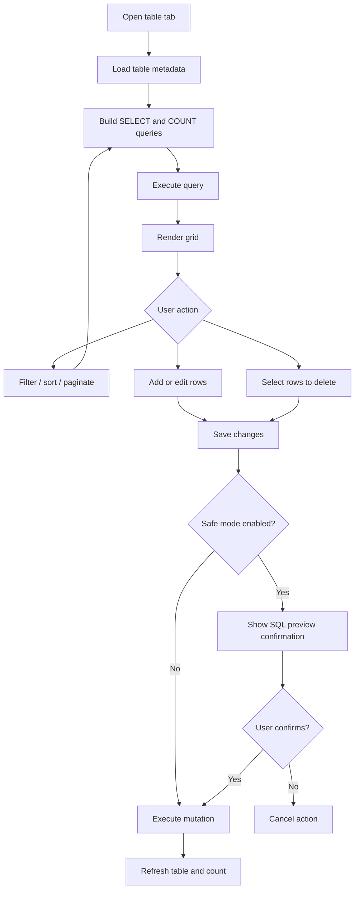

# Quick Query Module

**Document Type:** Business Analysis - Module Detail  
**Module:** Quick Query  
**Last Updated:** 2026-04-23

---

## Related Documents

- [Overview](../OVERVIEW.md)
- [Connection Module](./CONNECTION.md)
- [Environment Tags Module](./ENV_TAGS.md)
- [Raw Query Module](./RAW_QUERY.md)
- [Tab Container Module](./TAB_CONTAINER.md)
- [Global Settings Module](./GLOBAL_SETTINGS.md)

## 1. Module Purpose

Quick Query gives users a visual way to browse, filter, inspect, and edit table data without writing SQL manually. It is the primary friendly database workflow for users who need direct table access but may not be comfortable writing raw queries.

Business meaning: Quick Query turns a database table into an interactive data grid with controlled actions.

## 2. Business Value

| Value                | Description                                                         |
| -------------------- | ------------------------------------------------------------------- |
| Friendly data access | Users can inspect table rows through a grid                         |
| Lower SQL dependency | Users can filter, sort, paginate, edit, and delete without hand SQL |
| Safer mutation flow  | Save and delete actions can show SQL preview through safe mode      |
| Traceability         | Query history logs executed SQL and error details                   |
| Relationship context | Users can preview referenced and back-referenced table data         |

## 3. Main Capabilities

| Capability        | Description                                                   |
| ----------------- | ------------------------------------------------------------- |
| Load table data   | Build and execute `SELECT` query for selected schema/table    |
| Count rows        | Execute count query for pagination state                      |
| Filter rows       | Build `WHERE` clauses from visual filter input                |
| Compose filters   | Combine filters with configured `AND` or `OR` operator        |
| Sort rows         | Build `ORDER BY` with optional null ordering behavior         |
| Paginate rows     | Move data window by `LIMIT` and `OFFSET`                      |
| Add rows          | Insert new local row and generate insert SQL on save          |
| Edit cells        | Track changed cell values and generate update SQL on save     |
| Delete rows       | Generate delete SQL from selected rows and primary key values |
| Safe mode preview | Show SQL confirmation before save/delete when enabled         |
| History log       | Store executed query text, query time, and error data         |
| Error popup       | Show query or mutation failure details                        |

## 4. Current Query Model

Quick Query builds these query types:

| Query Type   | Purpose                         |
| ------------ | ------------------------------- |
| Data query   | Fetch visible table rows        |
| Count query  | Count total rows for pagination |
| Insert query | Save newly added rows           |
| Update query | Save changed existing rows      |
| Delete query | Delete selected rows            |

The table data query is built from:

- Schema name
- Table name
- Filter state
- Sort state
- Pagination state
- Null-order preference where supported

## 5. Quick Query Flow

## 6. Safe Mode

Safe mode is configured globally in settings through `quickQuerySafeModeEnabled`.

| Action | Safe Mode Behavior                                 |
| ------ | -------------------------------------------------- |
| Save   | Shows generated insert/update SQL before execution |
| Delete | Shows generated delete SQL before execution        |

Safe mode is important for non-technical users and production-like environments because it makes hidden SQL visible before data changes happen.

## 7. Query State Persistence

Quick Query persists UI-only query builder state in renderer `localStorage` by workspace, connection, schema, and table.

Persisted state includes:

- Filters
- Pagination
- Sort order
- Filter visibility
- Filter compose operator

This state is intentionally not part of the backup/Electron persistence contract.

## 8. Business Rules

| ID       | Rule                                                                      |
| -------- | ------------------------------------------------------------------------- |
| QQ-BR-01 | Quick Query requires an active workspace, connection, schema, and table   |
| QQ-BR-02 | Pagination limit must be greater than zero                                |
| QQ-BR-03 | Pagination offset cannot be negative                                      |
| QQ-BR-04 | Save does nothing when there are no edited cells                          |
| QQ-BR-05 | Delete does nothing when there are no selected rows                       |
| QQ-BR-06 | Update/delete SQL depends on primary key values                           |
| QQ-BR-07 | Safe mode confirmation must run before save/delete mutation when enabled  |
| QQ-BR-08 | Query errors should be logged and shown to the user                       |
| QQ-BR-09 | Query builder state is scoped by workspace, connection, schema, and table |
| QQ-BR-10 | Null order preference applies only where the target database supports it  |

## 9. UX Requirements

- Data grid should support scanning large tables.
- Filter, pagination, and sort controls should be visible and predictable.
- Error messages should explain the query or mutation failure.
- Mutations should provide confirmation and feedback.
- Query history should help users understand what was executed.
- Non-technical users should not need to understand generated SQL unless safe mode asks them to review it.

## 10. Acceptance Criteria

- Given a table is opened, when metadata and rows load successfully, then rows appear in the grid.
- Given the user applies filters, when they refresh or execute, then filtered data and row count update.
- Given the user edits rows and safe mode is enabled, when they save, then SQL preview appears before execution.
- Given the user deletes selected rows and confirms, when the API succeeds, then the table refreshes.
- Given a query fails, when the response returns an error, then the error popup and history log include useful details.

## 11. Open Questions

| ID    | Question                                                                  |
| ----- | ------------------------------------------------------------------------- |
| QQ-Q1 | Should safe mode become mandatory for prod-tagged connections?            |
| QQ-Q2 | Should tables without primary keys block update/delete with clearer copy? |
| QQ-Q3 | Should non-technical users get a read-only Quick Query mode?              |
| QQ-Q4 | Should query builder state be included in backup/restore later?           |
