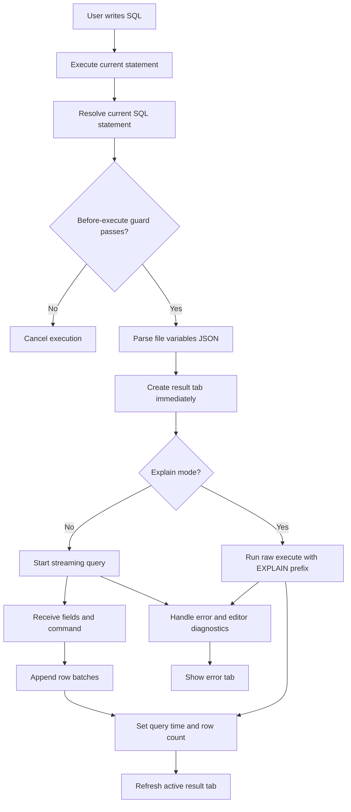

# Raw Query Module

**Document Type:** Business Analysis - Module Detail  
**Module:** Raw Query  
**Last Updated:** 2026-04-23

---

## Related Documents

- [Overview](../OVERVIEW.md)
- [Connection Module](./CONNECTION.md)
- [Quick Query Module](./QUICK_QUERY.md)
- [Tab Container Module](./TAB_CONTAINER.md)
- [Agent Module](./AGENT.md)
- [Global Settings Module](./GLOBAL_SETTINGS.md)

## 1. Module Purpose

Raw Query provides a full SQL editor workflow for users who want direct control over SQL execution. It supports writing SQL, executing the current statement, streaming results, viewing multiple result tabs, using variables, formatting SQL, and running explain/analyze workflows.

Business meaning: Raw Query is the power-user database console inside each workspace and connection.

## 2. Business Value

| Value                  | Description                                                |
| ---------------------- | ---------------------------------------------------------- |
| Direct SQL control     | Technical users can write and execute precise SQL          |
| Fast investigation     | Users can run one-off queries without leaving the app      |
| Result comparison      | Multiple result tabs allow users to compare query runs     |
| Large result feedback  | Streaming execution progressively shows rows and row count |
| Debugging support      | Error diagnostics can mark SQL editor positions            |
| Parameterized workflow | File variables allow reusable query templates              |

## 3. Main Capabilities

| Capability            | Description                                                     |
| --------------------- | --------------------------------------------------------------- |
| SQL editing           | CodeMirror-based SQL editor                                     |
| Execute current query | Detect and execute the current SQL statement                    |
| Streaming execution   | Render query rows progressively                                 |
| Cancel streaming      | Abort an in-flight streaming query                              |
| Result tabs           | Add, refresh, close, switch, close others, and close right tabs |
| Result views          | Result, error, raw, info, agent, and explain views              |
| Variables             | Store file-level variables as JSON and pass them to execution   |
| Explain Analyze       | Build `EXPLAIN` prefix with selected options                    |
| Format SQL            | Format full editor content or current statement                 |
| Connection selection  | Run a SQL file against a selected connection in the workspace   |
| File persistence      | Save SQL file contents, variables, and cursor position          |

## 4. Executed Result Model

```ts
interface ExecutedResultItem {
  id: string;
  metadata: {
    queryTime: number;
    statementQuery: string;
    executedAt: Date;
    executeErrors?: {
      message: string;
      data: Partial<DatabaseDriverError>;
    };
    fieldDefs?: FieldDef[];
    connection?: Connection;
    command?: string;
    rowCount?: number;
  };
  result: RowData[];
  seqIndex: number;
  view: 'result' | 'error' | 'info' | 'raw' | 'agent' | 'explain';
}
```

## 5. Query Execution Flow



## 6. Result Tab Behavior

| Action         | Behavior                                                   |
| -------------- | ---------------------------------------------------------- |
| Add result     | New result tab is prepended and made active                |
| Refresh result | Existing result tab is immutably updated for reactivity    |
| Close result   | Active tab switches to remaining tab or becomes empty      |
| Close others   | Keeps selected result tab only                             |
| Close to right | Keeps tabs from the first through selected tab             |
| Change view    | Updates result display mode without re-executing the query |

## 7. File Content and Variables

Raw Query is connected to workspace SQL files.

Persisted file-related values include:

- SQL file content
- File variables
- Cursor position

Variables are stored as JSON text and passed to query execution as parameters when valid JSON can be parsed.

## 8. Business Rules

| ID       | Rule                                                                     |
| -------- | ------------------------------------------------------------------------ |
| RQ-BR-01 | Raw Query requires an active SQL file and selected connection            |
| RQ-BR-02 | Execution uses the current SQL statement, not necessarily the full file  |
| RQ-BR-03 | A result tab is created immediately so users get feedback                |
| RQ-BR-04 | Streaming queries can be cancelled                                       |
| RQ-BR-05 | Query variables must be valid JSON to be passed as parameters            |
| RQ-BR-06 | Execution errors should be visible in result tabs and editor diagnostics |
| RQ-BR-07 | Explain Analyze results use explain-specific result view                 |
| RQ-BR-08 | SQL file content changes should persist through the explorer file store  |

## 9. UX Requirements

- SQL editor should remain responsive during result rendering.
- Result tabs should be easy to compare and close.
- Streaming state should show progress through row count and loading status.
- Errors should be readable and tied back to SQL where possible.
- Variables should help users reuse query files safely.

## 10. Acceptance Criteria

- Given a user executes a valid statement, when rows stream back, then the active result tab updates progressively.
- Given a query fails, when the database returns an error, then the result tab switches to error view.
- Given a user cancels an in-flight streaming query, when cancellation succeeds, then loading and streaming states stop.
- Given a user edits SQL file content, when content changes, then the file store receives the update.
- Given a user runs Explain Analyze, when execution completes, then the result tab uses explain view.

## 11. Open Questions

| ID    | Question                                                                    |
| ----- | --------------------------------------------------------------------------- |
| RQ-Q1 | Should mutation SQL require the same safe-mode confirmation as Quick Query? |
| RQ-Q2 | Should variables have a form editor instead of raw JSON only?               |
| RQ-Q3 | Should result tabs persist across app restart?                              |
| RQ-Q4 | Should non-technical users have restricted access to Raw Query?             |
