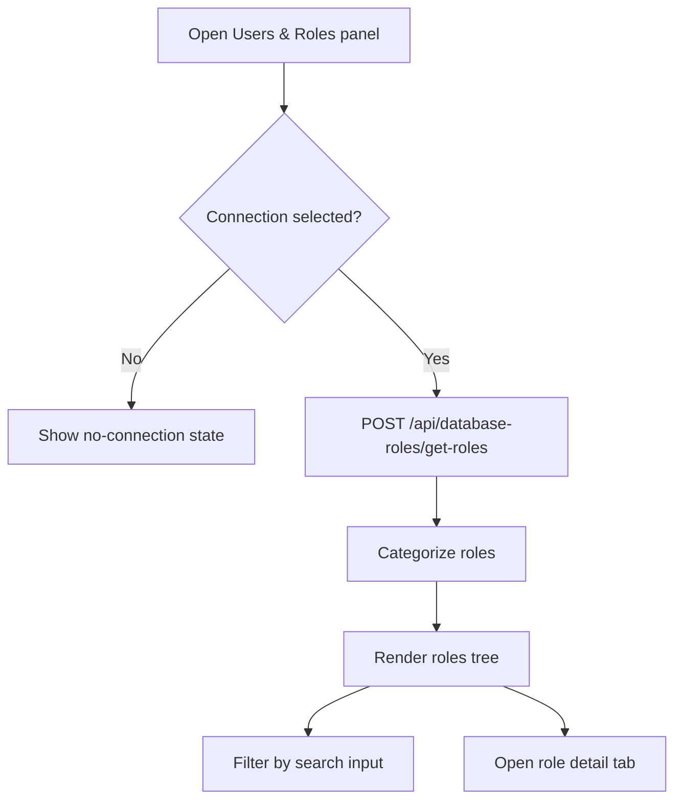
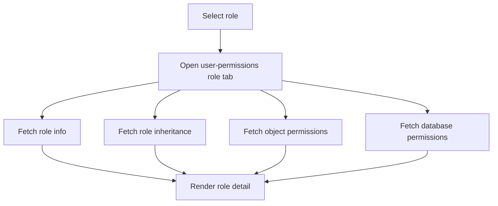
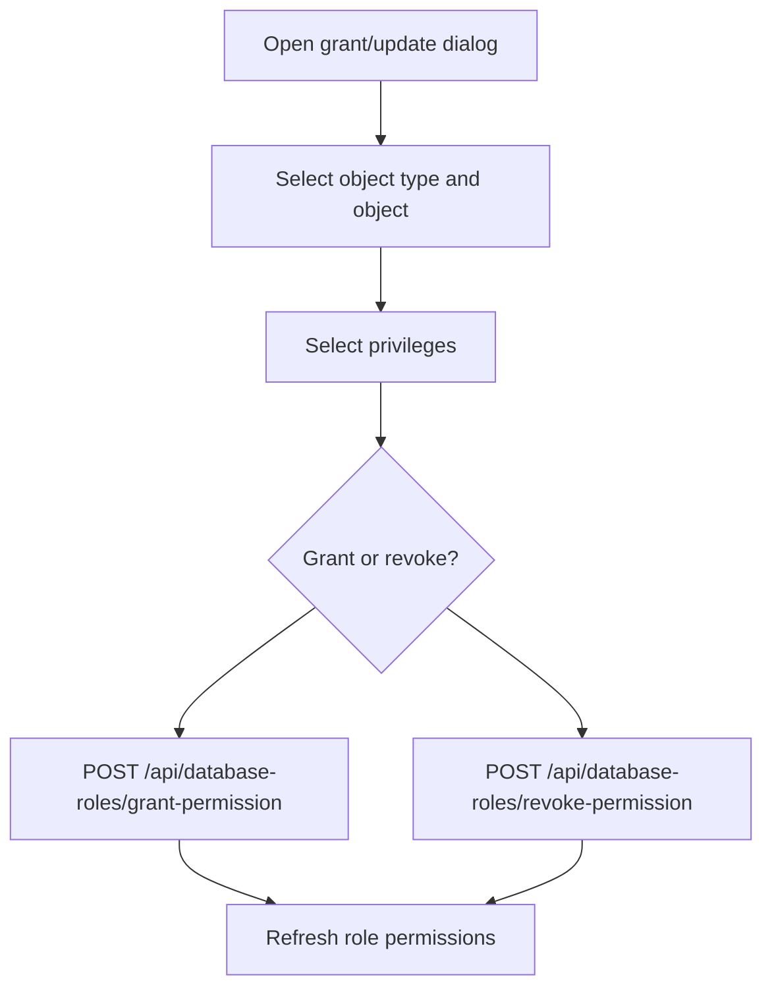
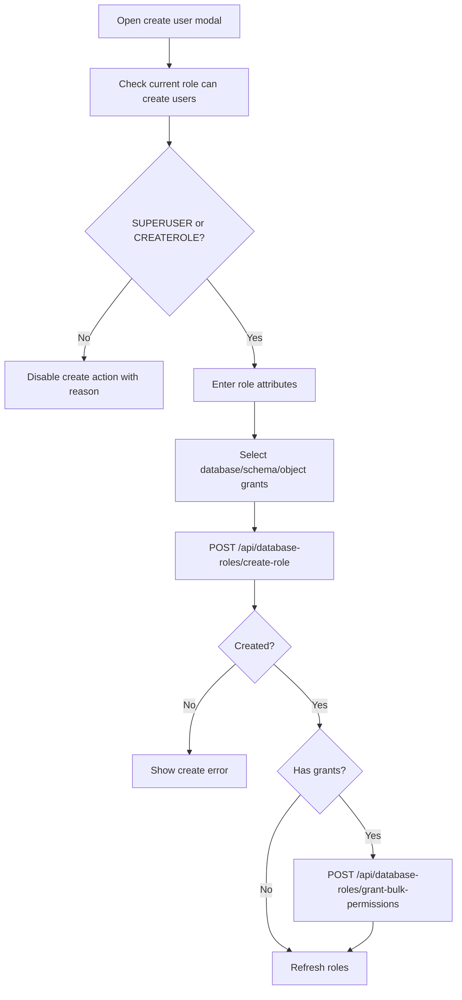

# Role & Permission Module

**Document Type:** Business Analysis - Module Detail  
**Module:** Role & Permission  
**Last Updated:** 2026-04-23

---

## Related Documents

- [Overview](../OVERVIEW.md)
- [Requirements](../REQUIREMENTS.md)
- [Connection Module](./CONNECTION.md)
- [Tab Container Module](./TAB_CONTAINER.md)
- [Instance Insights Module](./INSTANCE_INSIGHTS.md)
- [Global Settings Module](./GLOBAL_SETTINGS.md)

## 1. Module Purpose

The Role & Permission module helps users inspect and manage database users, roles, and permissions from inside OrcaQ. It provides role discovery, role categorization, role detail pages, database-level permissions, object-level permissions, grant/revoke workflows, and user creation/deletion workflows where supported.

Business meaning: this module turns database access control into a visible, manageable workflow for admins and technical users.

## 2. Business Value

| Value                | Description                                                                      |
| -------------------- | -------------------------------------------------------------------------------- |
| Access visibility    | Users can see who can log in, create databases, create roles, or replicate       |
| Permission clarity   | Permissions are grouped by database, schema, table, view, function, and sequence |
| Safer administration | Grant/revoke and create/delete operations are explicit user actions              |
| Faster audit support | Role attributes and permissions are visible in one workflow                      |
| Project context      | Role work happens inside the active workspace and connection                     |

## 3. Target Users

| User              | Need                                                                      |
| ----------------- | ------------------------------------------------------------------------- |
| DBA               | Inspect and manage database users, roles, inheritance, and permissions    |
| Backend engineer  | Verify application database user privileges                               |
| DevOps engineer   | Review connection roles and operational access                            |
| Security reviewer | Audit risky privileges such as superuser, create role, or create database |
| Project admin     | Create users and assign scoped access where supported                     |

## 4. Current Role Model

```ts
interface DatabaseRole {
  roleName: string;
  roleOid: number;
  isSuperuser: boolean;
  canLogin: boolean;
  canCreateDb: boolean;
  canCreateRole: boolean;
  isReplication: boolean;
  connectionLimit: number;
  validUntil: string | null;
  memberOf: string[];
  comment: string | null;
}
```

| Field             | Business Meaning                               |
| ----------------- | ---------------------------------------------- |
| `roleName`        | Database role or user name                     |
| `roleOid`         | Database internal role identifier              |
| `isSuperuser`     | Whether the role has superuser privileges      |
| `canLogin`        | Whether the role can log in as a user          |
| `canCreateDb`     | Whether the role can create databases          |
| `canCreateRole`   | Whether the role can create or manage roles    |
| `isReplication`   | Whether the role can perform replication tasks |
| `connectionLimit` | Maximum allowed connections for the role       |
| `validUntil`      | Optional expiration timestamp                  |
| `memberOf`        | Roles this role belongs to                     |
| `comment`         | Optional database role comment                 |

## 5. Permission Model

```ts
type ObjectType = 'table' | 'schema' | 'function' | 'sequence' | 'view';

interface ObjectPermission {
  objectType: ObjectType;
  schemaName: string;
  objectName: string;
  privileges: PrivilegeType[];
  grantedBy: string;
  isGrantable: boolean;
}

interface RolePermissions {
  roleName: string;
  tablePermissions: ObjectPermission[];
  schemaPermissions: ObjectPermission[];
  viewPermissions: ObjectPermission[];
  functionPermissions: ObjectPermission[];
}
```

Supported privilege types include:

- `SELECT`
- `INSERT`
- `UPDATE`
- `DELETE`
- `TRUNCATE`
- `REFERENCES`
- `TRIGGER`
- `USAGE`
- `CREATE`
- `EXECUTE`
- `ALL`

## 6. Main Capabilities

| Capability                | Description                                                           |
| ------------------------- | --------------------------------------------------------------------- |
| Fetch roles               | Load all roles/users for the active connection                        |
| Categorize roles          | Group roles into superusers, login users, and role-only entries       |
| Search roles              | Filter the role tree by role name                                     |
| View role details         | Show role attributes and inherited roles                              |
| View database permissions | Show database-level connect/create/temp privileges                    |
| View object permissions   | Show permissions for tables, schemas, views, functions, and sequences |
| Grant permissions         | Add selected privileges to a role                                     |
| Revoke permissions        | Remove selected privileges from a role                                |
| Create role/user          | Create a role and optionally grant permissions through a wizard       |
| Delete role/user          | Delete an existing role/user                                          |
| Bulk grant permissions    | Apply multiple database/schema/object grants after role creation      |
| Fetch schema objects      | Load schema tables, views, functions, and sequences for grant wizard  |

## 7. Role List Flow



## 8. Role Detail Flow



## 9. Grant/Revoke Flow



## 10. Create User Flow



## 11. API Areas

| Area                     | Endpoint Pattern                                     |
| ------------------------ | ---------------------------------------------------- |
| Get roles                | `/api/database-roles/get-roles`                      |
| Get role                 | `/api/database-roles/get-role`                       |
| Get role inheritance     | `/api/database-roles/get-role-inheritance`           |
| Get permissions          | `/api/database-roles/get-permissions`                |
| Grant permission         | `/api/database-roles/grant-permission`               |
| Revoke permission        | `/api/database-roles/revoke-permission`              |
| Create role              | `/api/database-roles/create-role`                    |
| Delete role              | `/api/database-roles/delete-role`                    |
| Get databases            | `/api/database-roles/get-databases`                  |
| Get database permissions | `/api/database-roles/get-databases-with-permissions` |
| Get schemas              | `/api/database-roles/get-schemas`                    |
| Get schema objects       | `/api/database-roles/get-schema-objects`             |
| Bulk grant permissions   | `/api/database-roles/grant-bulk-permissions`         |

## 12. Business Rules

| ID        | Rule                                                                                          |
| --------- | --------------------------------------------------------------------------------------------- |
| RLP-BR-01 | Role & Permission requires an active connection                                               |
| RLP-BR-02 | Roles should be grouped into superusers, login users, and role-only entries                   |
| RLP-BR-03 | Create user action requires current role to be superuser or have create-role privilege        |
| RLP-BR-04 | Grant/revoke actions must send active connection context                                      |
| RLP-BR-05 | Permission mutations should refresh permissions after success                                 |
| RLP-BR-06 | Role creation can be followed by bulk permission grants                                       |
| RLP-BR-07 | Partial bulk grant failure should be shown without hiding created role result                 |
| RLP-BR-08 | Role detail should show attributes, inheritance, object permissions, and database permissions |
| RLP-BR-09 | Delete role should refresh the role list after success                                        |
| RLP-BR-10 | Unsupported database engines should show clear limitations                                    |

## 13. UX Requirements

- Role tree should be searchable and collapsible.
- Create user button should explain why it is disabled.
- Risky privileges such as superuser, create database, create role, and replication should be visually clear.
- Grant/revoke dialogs should show available privileges by object type.
- Errors should distinguish role creation failure from permission grant failure.
- Role detail should be readable enough for access reviews.

## 14. Acceptance Criteria

- Given a connection is selected, when Users & Roles opens, then roles are fetched and shown in categorized groups.
- Given the current role lacks `SUPERUSER` and `CREATEROLE`, when the user hovers create user, then the disabled reason explains missing privilege.
- Given a role is selected, when the role tab opens, then role attributes, inheritance, object permissions, and database permissions load.
- Given permissions are granted or revoked, when the request succeeds, then permissions refresh for that role.
- Given a user is created with grants, when role creation succeeds and grant operations succeed, then roles refresh and the modal closes.
- Given bulk grants partially fail, when the response returns failures, then the UI shows that the user was created but some grants failed.

## 15. Open Questions

| ID     | Question                                                                                               |
| ------ | ------------------------------------------------------------------------------------------------------ |
| RLP-Q1 | Should role and permission management be PostgreSQL-only until other adapters mature?                  |
| RLP-Q2 | Should production-tagged connections require strict confirmation for grant/revoke/delete role actions? |
| RLP-Q3 | Should the app support permission diff export for audit reviews?                                       |
| RLP-Q4 | Should non-admin users see read-only role permissions instead of hidden UI?                            |
| RLP-Q5 | Should role creation templates exist for read-only, analyst, QA, and app user profiles?                |
