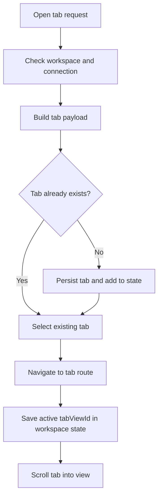
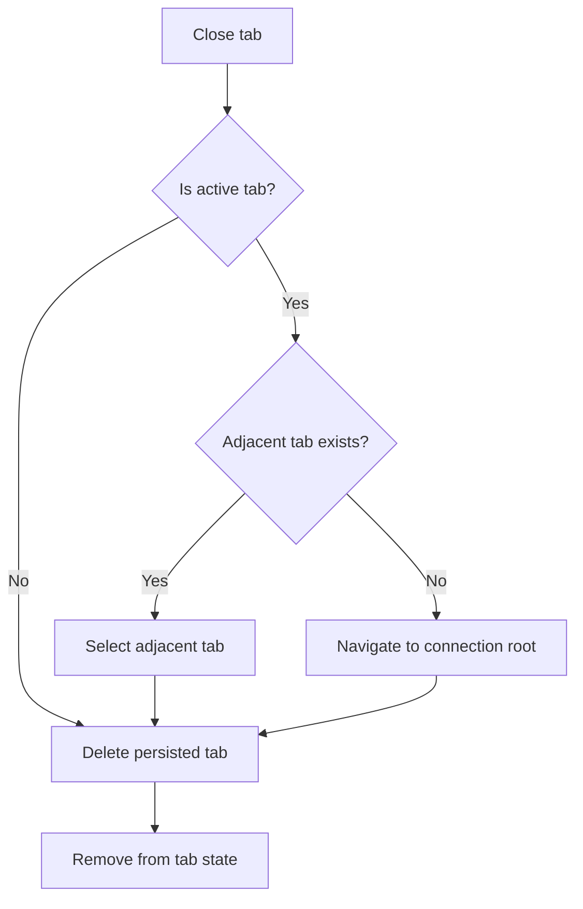

# Tab Container Module

**Document Type:** Business Analysis - Module Detail  
**Module:** Tab Container  
**Last Updated:** 2026-04-23

---

## Related Documents

- [Overview](../OVERVIEW.md)
- [Workspace State Module](./WORKSPACE_STATE.md)
- [Quick Query Module](./QUICK_QUERY.md)
- [Raw Query Module](./RAW_QUERY.md)
- [ERD Module](./ERD.md)
- [Role & Permission Module](./ROLE_PERMISSION.md)
- [Instance Insights Module](./INSTANCE_INSIGHTS.md)

## 1. Module Purpose

The Tab Container module manages the main working tabs inside a workspace and connection. It lets users open multiple database objects and tools, switch between them, reorder them, close them, and resume the active tab context through workspace state.

Business meaning: the tab container is the user's project workbench.

## 2. Business Value

| Value                | Description                                                      |
| -------------------- | ---------------------------------------------------------------- |
| Multi-task workflow  | Users can work across tables, SQL files, schemas, ERD, and tools |
| Context preservation | Active tab is saved into workspace state                         |
| Faster navigation    | Existing tabs can be reselected instead of recreated             |
| Reduced confusion    | Tabs carry icon, name, route, schema, connection, and metadata   |
| Workspace isolation  | Tabs are scoped by workspace and connection                      |

## 3. Current Tab Model

```ts
type TabView = {
  workspaceId: string;
  connectionId: string;
  schemaId: string;
  id: string;
  index: number;
  name: string;
  icon: string;
  iconClass?: string;
  type: TabViewType;
  routeName: RouteNameFromPath<RoutePathSchema>;
  routeParams?: Record<string, string | number>;
  metadata?: TabMetadata;
};
```

## 4. Supported Tab Types

| Type                | Business Purpose                           |
| ------------------- | ------------------------------------------ |
| `Schema`            | Schema browser                             |
| `TableOverview`     | Tables list or overview                    |
| `TableDetail`       | Specific table data and structure          |
| `ViewOverview`      | Views list or overview                     |
| `ViewDetail`        | Specific view details                      |
| `FunctionsOverview` | Functions list or overview                 |
| `FunctionsDetail`   | Specific function details                  |
| `CodeQuery`         | SQL file / Raw Query editor                |
| `AllERD`            | Full ERD diagram                           |
| `DetailERD`         | Focused ERD diagram                        |
| `UserPermissions`   | Role/user permission detail                |
| `InstanceInsights`  | Database activity and operational insights |
| `AgentChat`         | AI agent chat workflow                     |
| `Connection`        | Connection-related tab                     |
| `Explorer`          | Explorer-related tab                       |
| `Export`            | Export workflow                            |
| `DatabaseTools`     | Database tooling area                      |

## 5. Tab Lifecycle Flow



## 6. Close Tab Flow



## 7. Main Capabilities

| Capability        | Description                                     |
| ----------------- | ----------------------------------------------- |
| Open tab          | Create and persist a new tab                    |
| Ensure tab        | Open if missing, then select                    |
| Select tab        | Navigate route and update active tab state      |
| Close tab         | Remove tab and navigate away safely if active   |
| Close others      | Keep selected tab and delete all others         |
| Close to right    | Delete tabs after the selected tab              |
| Reorder tabs      | Move tab position through drag-and-drop reorder |
| Load persisted    | Load tabs by workspace and connection           |
| Scroll active tab | Keep active tab visible in the tab bar          |

## 8. Business Rules

| ID        | Rule                                                               |
| --------- | ------------------------------------------------------------------ |
| TAB-BR-01 | Tabs require active workspace and connection context               |
| TAB-BR-02 | Tabs are loaded by workspace ID and connection ID                  |
| TAB-BR-03 | Opening an existing tab should select it instead of duplicating it |
| TAB-BR-04 | Selecting a tab must update workspace state active `tabViewId`     |
| TAB-BR-05 | Closing the active tab should select an adjacent tab when possible |
| TAB-BR-06 | Closing the last tab should navigate back to connection root       |
| TAB-BR-07 | Tab route params must include workspace and connection IDs         |
| TAB-BR-08 | Tab metadata should preserve object-specific context               |

## 9. UX Requirements

- Tabs should be easy to scan by icon and name.
- Closing tabs should not leave the user on a broken route.
- Reordering should affect the visible tab order immediately.
- Active tab should remain visible without stealing focus from editors.
- Tab state should remain scoped to the current workspace and connection.

## 10. Acceptance Criteria

- Given a user opens a table, when no tab exists, then a new table detail tab is created.
- Given a user opens the same object again, when the tab exists, then the existing tab becomes active.
- Given a user closes the active tab, when another tab exists, then an adjacent tab becomes active.
- Given a user switches workspace or connection, when tab data loads, then only tabs for that context appear.
- Given a tab route is selected, when navigation succeeds, then workspace state stores that tab ID.

## 11. Open Questions

| ID     | Question                                                              |
| ------ | --------------------------------------------------------------------- |
| TAB-Q1 | Should tab order persist after drag-and-drop reorder?                 |
| TAB-Q2 | Should users be able to pin tabs?                                     |
| TAB-Q3 | Should tab groups exist for schema/table/query/agent categories?      |
| TAB-Q4 | Should closing modified SQL tabs require unsaved-change confirmation? |
