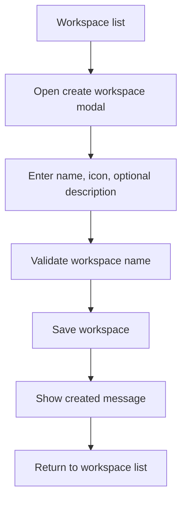

# Workspace Module

**Document Type:** Business Analysis - Module Detail  
**Module:** Workspace  
**Last Updated:** 2026-04-23

---

## Related Documents

- [Overview](../OVERVIEW.md)
- [Workspace State Module](./WORKSPACE_STATE.md)
- [Connection Module](./CONNECTION.md)
- [Tab Container Module](./TAB_CONTAINER.md)

## 1. Module Purpose

The Workspace module organizes OrcaQ by project or business context. Instead of forcing users to manage one global list of database connections, OrcaQ groups connections under workspaces so each workspace can represent a product, customer, team, system, or delivery project.

Examples:

- `Customer Portal`
- `Internal Admin`
- `Finance Reporting`
- `QA Sandbox`

## 2. Business Value

| Value                     | Description                                                        |
| ------------------------- | ------------------------------------------------------------------ |
| Project clarity           | Users can separate database work by project                        |
| Reduced context switching | Connections, tabs, and state can stay scoped to a workspace        |
| Friendlier onboarding     | Non-backend users can start from project names instead of DB hosts |
| Safer organization        | Production and test connections can live under clear project scope |

## 3. Users

| User               | Workspace Need                                                       |
| ------------------ | -------------------------------------------------------------------- |
| Admin user         | Create and maintain project workspaces                               |
| Developer          | Group all database environments for one application                  |
| QA user            | Open the correct project and switch between test or uat environments |
| Support operator   | Open the business system workspace before checking data              |
| Non-technical user | Select a recognizable project without needing database details       |

## 4. Current Data Model

```ts
interface Workspace {
  id: string;
  icon: string;
  name: string;
  desc?: string;
  lastOpened?: string;
  createdAt: string;
  updatedAt?: string;
}
```

| Field        | Business Meaning                                         |
| ------------ | -------------------------------------------------------- |
| `id`         | Unique workspace identifier                              |
| `icon`       | Visual marker used in the workspace list                 |
| `name`       | User-facing project or workspace name                    |
| `desc`       | Optional explanation of the workspace purpose            |
| `lastOpened` | Last time the user opened the workspace                  |
| `createdAt`  | Workspace creation timestamp                             |
| `updatedAt`  | Last workspace metadata update timestamp, when available |

## 5. Main Capabilities

| Capability       | Description                                                   |
| ---------------- | ------------------------------------------------------------- |
| Create workspace | User enters name, icon, and optional description              |
| Update workspace | User can update name, icon, and description                   |
| Delete workspace | User can delete a workspace and its related persisted context |
| List workspaces  | User can see available workspaces before entering a project   |
| Open workspace   | App routes the user into the selected project context         |
| Track last open  | App can record when a workspace was last opened               |

## 6. Create Workspace Flow



## 7. Business Rules

| ID       | Rule                                                                 |
| -------- | -------------------------------------------------------------------- |
| WS-BR-01 | Workspace name is required                                           |
| WS-BR-02 | Workspace icon defaults to the configured default icon if not chosen |
| WS-BR-03 | Workspace description is optional                                    |
| WS-BR-04 | Workspace `id` is generated by the application                       |
| WS-BR-05 | A workspace can contain many connections                             |
| WS-BR-06 | Deleting a workspace must clean related project context              |
| WS-BR-07 | Workspaces should be named in project/business language              |

## 8. Persistence Behavior

Workspace records are stored through the shared storage API. The storage implementation depends on runtime:

| Runtime       | Storage Path                                             |
| ------------- | -------------------------------------------------------- |
| Web / browser | IndexedDB-backed storage                                 |
| Desktop       | Electron adapter backed by the desktop persistence layer |

When a workspace is deleted in the browser storage path, related records are also cleaned up, including:

- Connections under that workspace
- Tab views under that workspace
- Raw query files under that workspace
- Workspace state for that workspace
- Quick Query logs for that workspace

## 9. Acceptance Criteria

- Given a user creates a workspace with a valid name, when the form is submitted, then the workspace appears in the workspace list.
- Given a user edits a workspace, when the update succeeds, then the list shows the updated name, icon, and description.
- Given a user deletes a workspace, when deletion succeeds, then the workspace and its related project context are removed.
- Given a non-technical user sees the workspace list, when reading available workspaces, then each workspace should be identifiable without reading database connection details.

## 10. Open Questions

| ID    | Question                                                                      |
| ----- | ----------------------------------------------------------------------------- |
| WS-Q1 | Should workspaces support owners, teams, or sharing in a future release?      |
| WS-Q2 | Should workspace templates pre-create common dev/test/uat/prod connections?   |
| WS-Q3 | Should users be able to archive a workspace instead of deleting it?           |
| WS-Q4 | Should workspace deletion require typing the workspace name for confirmation? |
