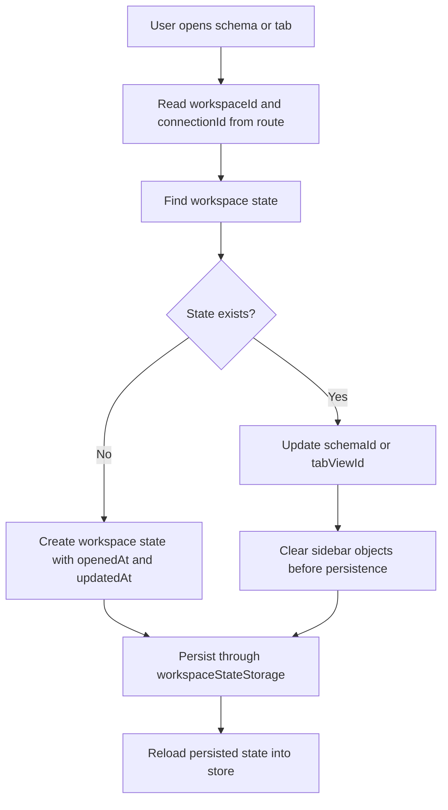

# Workspace State Module

**Document Type:** Business Analysis - Module Detail  
**Module:** Workspace State  
**Last Updated:** 2026-04-23

---

## Related Documents

- [Overview](../OVERVIEW.md)
- [Workspace Module](./WORKSPACE.md)
- [Connection Module](./CONNECTION.md)
- [Tab Container Module](./TAB_CONTAINER.md)

## 1. Module Purpose

Workspace State remembers where the user was inside a workspace and connection. It is the continuity layer for project work: active connection, selected schema, active tab, and sidebar-related context can be restored or reused when the user returns.

Business meaning: a workspace is the project container, while workspace state is the user's working position inside that project.

## 2. Business Value

| Value                     | Description                                                         |
| ------------------------- | ------------------------------------------------------------------- |
| Continuity                | Users can resume project work without rebuilding context every time |
| Lower friction            | Common active schema and tab choices can be remembered              |
| Safer navigation          | State is scoped by workspace and connection                         |
| Better project mental map | Users experience each workspace as a persistent project area        |

## 3. Current Data Model

```ts
interface WorkspaceConnectionState {
  id: string; // connectionId
  schemaId: string;
  tabViewId?: string;
  sideBarExplorer?: unknown;
  sideBarSchemas?: unknown;
}

interface WorkspaceState {
  id: string; // workspaceId
  connectionId?: string;
  connectionStates?: WorkspaceConnectionState[];
  openedAt?: string;
  updatedAt?: string;
}
```

| Field              | Business Meaning                                                       |
| ------------------ | ---------------------------------------------------------------------- |
| `id`               | Workspace identifier; this is not a separate state UUID                |
| `connectionId`     | Current or related connection context for the workspace state record   |
| `connectionStates` | Per-connection UI state inside the workspace                           |
| `schemaId`         | Active schema for a connection                                         |
| `tabViewId`        | Active tab for a connection                                            |
| `sideBarExplorer`  | Sidebar explorer context; currently cleared before persistence updates |
| `sideBarSchemas`   | Sidebar schema context; currently cleared before persistence updates   |
| `openedAt`         | Time when the workspace state was created or reopened                  |
| `updatedAt`        | Time when the state was last updated                                   |

## 4. Main Capabilities

| Capability                 | Description                                                    |
| -------------------------- | -------------------------------------------------------------- |
| Create workspace state     | Create state when a workspace/connection context needs it      |
| Load persisted state       | Load all saved workspace states into the store                 |
| Update selected schema     | Save the active schema for a workspace and connection          |
| Update selected tab        | Save the active tab for a workspace and connection             |
| Read current state         | Find state by workspace ID and connection ID                   |
| Normalize sidebar payloads | Clear non-persistable sidebar objects before storing the state |

## 5. State Update Flow



## 6. Business Rules

| ID        | Rule                                                                            |
| --------- | ------------------------------------------------------------------------------- |
| WSS-BR-01 | Workspace state is scoped to a workspace and connection context                 |
| WSS-BR-02 | Workspace state `id` uses the workspace ID                                      |
| WSS-BR-03 | A connection state uses the connection ID as its `id`                           |
| WSS-BR-04 | Selected schema should be remembered per connection                             |
| WSS-BR-05 | Selected tab should be remembered per connection when available                 |
| WSS-BR-06 | Non-persistable sidebar objects should not be stored as rich runtime references |
| WSS-BR-07 | Updating schema or tab should refresh `updatedAt`                               |

## 7. Persistence Behavior

Workspace state is stored through `workspaceStateStorage`.

| Runtime       | Storage Path                              |
| ------------- | ----------------------------------------- |
| Web / browser | IndexedDB-backed `workspaceState` storage |
| Desktop       | Electron workspace-state adapter          |

Workspace state is deleted when its workspace is deleted.

## 8. Acceptance Criteria

- Given a user selects a schema in a connection, when the state is saved, then the schema ID is available for that workspace and connection.
- Given a user opens a tab in a connection, when the state is saved, then the tab ID is available for that workspace and connection.
- Given a workspace is deleted, when cleanup runs, then the workspace state for that workspace is removed.
- Given runtime-only sidebar objects exist in state, when the state is persisted, then those objects are cleared instead of storing unsafe UI references.

## 9. BA Notes

- Workspace state should remain invisible to most users.
- The user-facing result should be simple: OrcaQ remembers useful project context.
- If future sharing is added, workspace state may need user-specific ownership so one user's active tab does not affect another user's context.

## 10. Open Questions

| ID     | Question                                                                    |
| ------ | --------------------------------------------------------------------------- |
| WSS-Q1 | Should workspace state be per user if team/shared workspaces are added?     |
| WSS-Q2 | Should active connection be restored automatically on workspace open?       |
| WSS-Q3 | Should users have a reset workspace state action for troubleshooting?       |
| WSS-Q4 | Should sidebar expanded/collapsed state become a stable persisted contract? |
