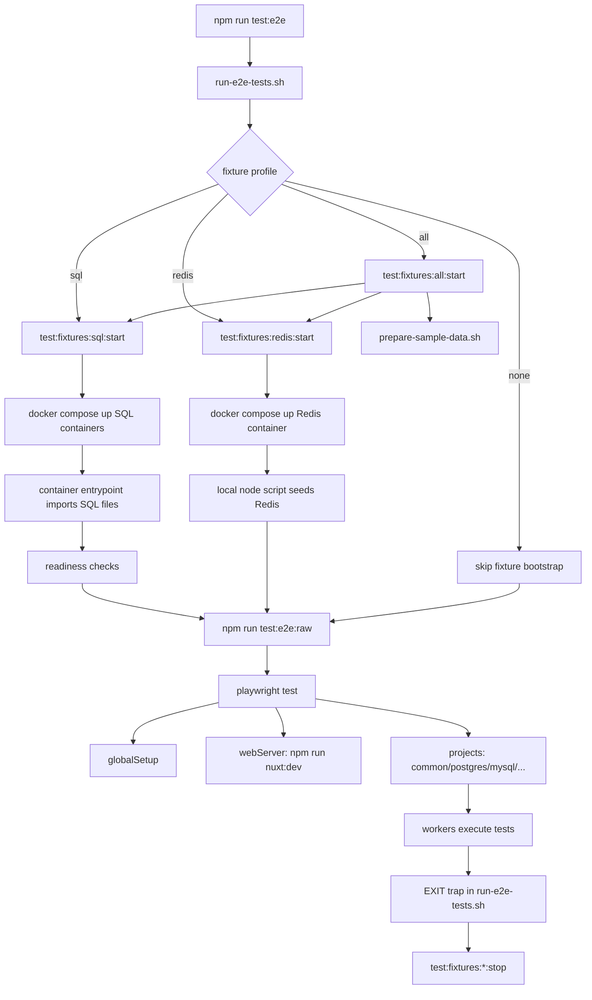
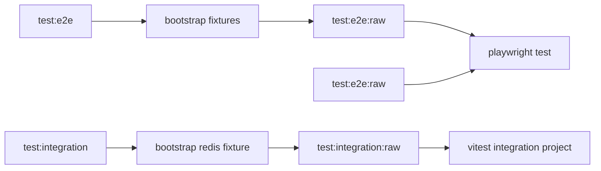

# E2E Test Flow

## Purpose

This document explains the current end-to-end and integration test flow in HeraQ:

- what the `test:*` scripts in `package.json` do
- which fixtures are started with Docker
- which parts run inside containers and which parts run on the local host
- how Vitest and Playwright fit together

## High-Level Summary

The repository currently has three main test layers:

- `unit`
  - runs with Vitest and does not require real database fixtures
- `nuxt`
  - runs with Vitest in a Nuxt / happy-dom environment
- `integration` and `playwright e2e`
  - may require local database fixtures
  - are orchestrated by shell scripts in `scripts/test-services/`

One important rule:

- scripts with the `:raw` suffix only run the test runner
- scripts without `:raw` bootstrap fixtures first, then call the runner

## Test Script Map

Sources:

- [package.json](/Volumes/Cinny/Cinny/Project/HeraQ/package.json:39)
- [vitest.config.ts](/Volumes/Cinny/Cinny/Project/HeraQ/vitest.config.ts:1)
- [playwright.config.ts](/Volumes/Cinny/Cinny/Project/HeraQ/playwright.config.ts:1)

### Vitest

- `test:all`
  - runs all Vitest projects
- `test:unit`
  - runs the `unit` project
- `test:nuxt`
  - runs the `nuxt` project
- `test:integration`
  - bootstraps the Redis fixture, then runs `test:integration:raw`
- `test:integration:raw`
  - runs `vitest --run --project integration`

### Playwright

- `test:e2e`
  - bootstraps all database fixtures, then runs `test:e2e:raw`
- `test:e2e:raw`
  - runs `playwright test`
- `test:e2e:common`
  - bootstraps all database fixtures, then runs the `common` Playwright project
- `test:e2e:postgres`
  - bootstraps all database fixtures, then runs the `postgres` project
- `test:e2e:mysql`
  - bootstraps all database fixtures, then runs the `mysql` project
- `test:e2e:mariadb`
  - bootstraps all database fixtures, then runs the `mariadb` project
- `test:e2e:oracle`
  - bootstraps all database fixtures, then runs the `oracle` project
- `test:e2e:redis`
  - bootstraps only the Redis fixture, then runs the `redis` project
- `test:e2e:sqlite`
  - runs the `sqlite` project directly and does not need SQL or Redis Docker fixtures

### Fixture Utility Scripts

- `test:fixtures:sql:start`
  - starts PostgreSQL, MySQL, and MariaDB with Compose
- `test:fixtures:sql:seed`
  - effectively recreates the SQL fixture flow by starting them again
- `test:fixtures:sql:stop`
  - stops the SQL fixtures
- `test:fixtures:redis:start`
  - starts Redis with Compose and seeds sample data
- `test:fixtures:redis:seed`
  - reseeds the Redis sample data
- `test:fixtures:redis:stop`
  - stops the Redis fixture
- `test:fixtures:db:start`
  - prepares the SQLite sample, starts SQL fixtures, and starts the Redis fixture
- `test:fixtures:db:stop`
  - stops the Redis fixture, then stops the SQL fixtures

## Vitest Project Layout

Source: [vitest.config.ts](/Volumes/Cinny/Cinny/Project/HeraQ/vitest.config.ts:1)

### `unit`

- test path: `test/unit/**/*.{test,spec}.ts`
- environment: `node`

### `integration`

- test path: `test/e2e/**/*.{test,spec}.ts`
- environment: `node`
- env loading: `loadEnv('e2e', process.cwd(), '')`

This is different from Playwright:

- the Vitest integration project loads `.env.e2e`
- the Playwright config does not currently call `loadEnv(...)`

### `nuxt`

- test path: `test/nuxt/**/*.{test,spec}.ts`
- environment: `nuxt`
- DOM environment: `happy-dom`

## Playwright Project Layout

Source: [playwright.config.ts](/Volumes/Cinny/Cinny/Project/HeraQ/playwright.config.ts:1)

The current Playwright projects are:

- `common`
- `postgres`
- `mysql`
- `mariadb`
- `oracle`
- `redis`
- `sqlite`

Playwright also uses:

- `globalSetup`: [test/playwright/global-setup.ts](/Volumes/Cinny/Cinny/Project/HeraQ/test/playwright/global-setup.ts:1)
- `webServer.command`: defaults to `npm run nuxt:dev`
- `baseURL`: defaults to `http://localhost:3000`
- `workers`: read from `PLAYWRIGHT_WORKERS`

Important note:

- `playwright.config.ts` reads `process.env` directly
- it does not use `dotenv` or `loadEnv(...)`

## Main Orchestrator Flow

Source: [scripts/test-services/run-e2e-tests.sh](/Volumes/Cinny/Cinny/Project/HeraQ/scripts/test-services/run-e2e-tests.sh:1)

`run-e2e-tests.sh` is the orchestration entrypoint for tests that need fixtures.

It does the following:

1. reads the `fixture_profile`
   - `none`
   - `redis`
   - `sql`
   - `all`
2. if no test script is passed, defaults to `test:db-matrix:playwright:raw`
3. starts fixtures based on the selected profile
4. runs each `npm run <script>`
5. stops fixtures on exit
6. if `HERAQ_KEEP_FIXTURES=1`, fixtures are left running

## SQL Fixture Flow

Sources:

- [scripts/test-services/start-sql-fixtures.sh](/Volumes/Cinny/Cinny/Project/HeraQ/scripts/test-services/start-sql-fixtures.sh:1)
- [test/fixtures/containers/sql-services.compose.yml](/Volumes/Cinny/Cinny/Project/HeraQ/test/fixtures/containers/sql-services.compose.yml:1)

### Engines Started

- PostgreSQL
- MySQL
- MariaDB

### Start Flow

`start-sql-fixtures.sh` performs these steps:

1. resolves `docker compose` or `podman compose`
2. cleans up any legacy Compose project if present
3. resets the current project with `down --volumes --remove-orphans`
4. runs `compose up -d`
5. waits for TCP ports
6. verifies schema and data readiness with real queries

### Where SQL Import Actually Runs

This is the easiest part to misunderstand.

The SQL fixture files live on the local filesystem:

- [test/fixtures/datasets/postgres/postgres-sakila-schema.sql](/Volumes/Cinny/Cinny/Project/HeraQ/test/fixtures/datasets/postgres/postgres-sakila-schema.sql:1)
- [test/fixtures/datasets/postgres/postgres-sakila-insert-data-optimized.sql](/Volumes/Cinny/Cinny/Project/HeraQ/test/fixtures/datasets/postgres/postgres-sakila-insert-data-optimized.sql:1)
- [test/fixtures/datasets/mysql/mysql-sakila-schema.sql](/Volumes/Cinny/Cinny/Project/HeraQ/test/fixtures/datasets/mysql/mysql-sakila-schema.sql:1)
- [test/fixtures/datasets/mysql/mysql-sakila-insert-data-optimized.sql](/Volumes/Cinny/Cinny/Project/HeraQ/test/fixtures/datasets/mysql/mysql-sakila-insert-data-optimized.sql:1)

However, the actual schema and data import happens inside the database containers, because the Compose file mounts those files into:

- `/docker-entrypoint-initdb.d/...`

Examples:

- PostgreSQL: [sql-services.compose.yml](/Volumes/Cinny/Cinny/Project/HeraQ/test/fixtures/containers/sql-services.compose.yml:12)
- MySQL: [sql-services.compose.yml](/Volumes/Cinny/Cinny/Project/HeraQ/test/fixtures/containers/sql-services.compose.yml:33)
- MariaDB: [sql-services.compose.yml](/Volumes/Cinny/Cinny/Project/HeraQ/test/fixtures/containers/sql-services.compose.yml:60)

In short:

- schema and data files: local files
- SQL restore or import execution: container entrypoint runtime

### Where Readiness Checks Run

#### PostgreSQL

The readiness check uses:

- `docker compose exec -T postgres psql ...`

Source: [start-sql-fixtures.sh](/Volumes/Cinny/Cinny/Project/HeraQ/scripts/test-services/start-sql-fixtures.sh:78)

That means:

- the local shell triggers the command
- `psql` itself runs inside the container

#### MySQL and MariaDB

The readiness check uses:

- a local `node` process
- `mysql2/promise`
- a connection to `127.0.0.1:<published-port>`

Source: [start-sql-fixtures.sh](/Volumes/Cinny/Cinny/Project/HeraQ/scripts/test-services/start-sql-fixtures.sh:100)

That means:

- the query check runs on the local host
- the database server is running inside the container

### Important Clarification

`start-sql-fixtures.sh` does not directly run:

- `pg_restore`
- `mysqldump`
- `mysqlpump`

The script only:

- starts the database containers
- relies on the image entrypoint to apply the mounted SQL fixture files
- verifies readiness after the data is available

## Redis Fixture Flow

Sources:

- [scripts/test-services/start-nosql-fixtures.sh](/Volumes/Cinny/Cinny/Project/HeraQ/scripts/test-services/start-nosql-fixtures.sh:1)
- [scripts/test-services/seed-nosql-fixtures.sh](/Volumes/Cinny/Cinny/Project/HeraQ/scripts/test-services/seed-nosql-fixtures.sh:1)

### Start Flow

1. resolves the Compose command
2. runs `compose up -d`
3. waits for the Redis TCP port
4. calls `seed-nosql-fixtures.sh`
5. the seed script runs:
   - [seed-redis-fixture.mjs](/Volumes/Cinny/Cinny/Project/HeraQ/scripts/test-services/seed-redis-fixture.mjs:1)

### Where Seeding Runs

Redis seeding currently runs on the local host:

- `node seed-redis-fixture.mjs`

That script connects to the Redis container through the published port.

## SQLite Fixture Flow

Source: [scripts/test-services/prepare-sample-data.sh](/Volumes/Cinny/Cinny/Project/HeraQ/scripts/test-services/prepare-sample-data.sh:1)

This script prepares local sample assets before the SQL fixtures boot:

1. read raw `*-sakila-insert-data.sql` files for MySQL, Oracle, SQL Server, and SQLite
2. keep the PostgreSQL optimized fixture at `test/fixtures/datasets/postgres/postgres-sakila-insert-data-optimized.sql`
3. generate matching `*-sakila-insert-data-optimized.sql` files for MySQL, Oracle, SQL Server, and SQLite
4. build the local SQLite sample file from the optimized SQLite dataset
5. let Playwright or app tests use the optimized fixture data and generated SQLite sample

## Diagram: Full Test Orchestration



## Diagram: SQL Fixture Bootstrap

```mermaid
flowchart TD
    A[start-sql-fixtures.sh] --> B[resolve docker or podman compose]
    B --> C[compose down old project]
    C --> D[compose up -d]
    D --> E[postgres container]
    D --> F[mysql container]
    D --> G[mariadb container]
    E --> H[/docker-entrypoint-initdb.d executes bootstrap + schema + data + grants]
    F --> I[/docker-entrypoint-initdb.d executes schema + data + grants]
    G --> J[/docker-entrypoint-initdb.d executes schema + data + grants]
    H --> K[local shell runs docker compose exec postgres psql readiness check]
    I --> L[local node mysql2 readiness check via published port]
    J --> M[local node mysql2 readiness check via published port]
    K --> N[fixtures ready]
    L --> N
    M --> N
```

## Diagram: `raw` vs Non-`raw`



## Worker Behavior

This is another common source of confusion:

- Playwright workers do not call `docker compose up` multiple times inside a single `playwright test` run
- fixture bootstrap happens before Playwright starts its worker pool

This is true because:

- `docker compose up` is part of the shell wrapper:
  - [run-e2e-tests.sh](/Volumes/Cinny/Cinny/Project/HeraQ/scripts/test-services/run-e2e-tests.sh:1)
- workers only exist inside:
  - [playwright.config.ts](/Volumes/Cinny/Cinny/Project/HeraQ/playwright.config.ts:9)

So if increasing workers causes failures, the more likely reasons are:

- shared application state
- shared seeded database state
- race conditions between tests
- test suites that are not thread-safe

It is not because each worker starts Docker independently.

## Environment Variable Notes

### Vitest

The Vitest integration project calls `loadEnv('e2e', ...)`, so it can read `.env.e2e`.

Source: [vitest.config.ts](/Volumes/Cinny/Cinny/Project/HeraQ/vitest.config.ts:20)

### Playwright

The current Playwright config:

- reads `process.env` directly
- does not call `loadEnv(...)`
- does not import `dotenv`

Sources:

- [playwright.config.ts](/Volumes/Cinny/Cinny/Project/HeraQ/playwright.config.ts:7)
- [test/playwright/global-setup.ts](/Volumes/Cinny/Cinny/Project/HeraQ/test/playwright/global-setup.ts:95)

That means if Playwright is expected to use `.env.e2e` or `.env.test`, something else must load those variables before the Playwright process starts.

## Recommended Mental Model

When reading the HeraQ test flow, the cleanest model is:

- `package.json` scripts are the orchestration layer
- `scripts/test-services/*.sh` are the fixture bootstrap layer
- `compose.yml` files are the real database infrastructure layer
- `Vitest` and `Playwright` are the runner layer
- `datasets/*.sql` files are the fixture input layer

## References

- [package.json](/Volumes/Cinny/Cinny/Project/HeraQ/package.json:39)
- [vitest.config.ts](/Volumes/Cinny/Cinny/Project/HeraQ/vitest.config.ts:1)
- [playwright.config.ts](/Volumes/Cinny/Cinny/Project/HeraQ/playwright.config.ts:1)
- [scripts/test-services/run-e2e-tests.sh](/Volumes/Cinny/Cinny/Project/HeraQ/scripts/test-services/run-e2e-tests.sh:1)
- [scripts/test-services/start-sql-fixtures.sh](/Volumes/Cinny/Cinny/Project/HeraQ/scripts/test-services/start-sql-fixtures.sh:1)
- [scripts/test-services/start-nosql-fixtures.sh](/Volumes/Cinny/Cinny/Project/HeraQ/scripts/test-services/start-nosql-fixtures.sh:1)
- [scripts/test-services/prepare-sample-data.sh](/Volumes/Cinny/Cinny/Project/HeraQ/scripts/test-services/prepare-sample-data.sh:1)
- [test/fixtures/containers/sql-services.compose.yml](/Volumes/Cinny/Cinny/Project/HeraQ/test/fixtures/containers/sql-services.compose.yml:1)
- [test/fixtures/containers/nosql-services.compose.yml](/Volumes/Cinny/Cinny/Project/HeraQ/test/fixtures/containers/nosql-services.compose.yml:1)
